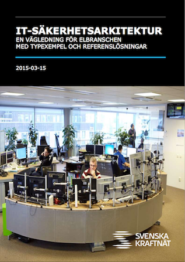

# Introduktion

## Bakgrund
Svenska kraftnät, SvK, har sedan 2011 genomfört en serie olika projekt med målet att införa ett
antal olika säkerhetshöjande åtgärder, främst inom IT- och informationssäkerhet, relaterat till
säkerhetskydd för den svenska elbranschen. Många av de projektresultat som tagits fram under
åren i flera delprojekt finns tillgängliga i form av vägledningar, checklistor, mallar, med
mera från Svenska kraftnäts webb, [www.svk.se], eller från energisäkerhetsportalens webbplats [energisakerhetsportalen].

Under 2014 utkom en vägledning om [IT-sakerhetsarkitektur] från Svenska kraftnät. Det är en
vägledning med inriktning mot informations- och IT-säkerhet, med målet att flera organisationer inom den
svenska elbranschen skall kunna bygga säkrare IT-miljöer. Dessa IT-miljöer används ofta inom
automation eller inom andra stödfunktioner inom elbolag och är därför viktiga eller tillochmed
kritiska för att lokala, regionala eller tillochmed nationella delar av elförsörjningen fungerar.

För att fortsätta säkerhetsarbetet mot svenska elbolag, och för att ta ytterliggare steg när väl IT-säkerhetsarkitektur 
blivit identifierat och definierat, så har fokusen kommit till säkerhetskontroller - det vill säga olika säkerhetsmekanismer och tekniska skydd.

Denna vägledning beskrev ett antal säkerhetskomponenter,  säkerhetskontroller och funktionalitet som bör finnas i en IT-miljö för att hålla en viss
nivå av grundskydd. Dessa programpaket är ett sätt att underlätta för svenska elbolag att
upprätta och förvalta en IT-säkerhetsarkitektur, såsom den beskrivs i vägledningen.

För att lättare förstå de olika begreppen och dess relation till varandra så har vi inkluderat ett
relationsdiagram som bättre visar vad IT-säkerhetsarkitektur är för något och hur det i sin tur
relaterar, och i vissa fall styr andra delar av IT.

Förutom en allmän kompetenshöjning i form av råd, vägledningar och information, så finns det
ett generellt behov att få hjälp på traven att bygga säkrare och bättre system och IT-miljöer. 

I detta projekt så har ett antal konkreta hjälpmedel, i form av paketering av mjukvara som
kan installeras på en PC-server, tagits fram för att kunna bistå den svenska elbranschen med praktiska
verktyg för att kunna införa en grundsäkerhetsnivå i sina ICS- och SCADA-miljöer.

## Projekt
Under 2015 initierades ett projekt av Svenska kraftnät och dess säkerhetschef Alireza Hafezi inom ramen för deras säkerhetshöjande arbete inom den svenska elbranschen.

Projektets arbete är att skapa ett antal säkerhetskomponenter baserade på öppen källkod som skall kunna användas av svenska elbolag i första hand, men eftersom de är
fritt tillgängliga, så är de även möjliga att använda för andra också.

* Som grundskydd för svenska elbolag som inte har budget eller möjlighet att skaffa tekniska skyddsmekanismer
* Som kompletterande delar till demonstratorn för att visa på hur skyddsmekanismer fungerar
* Ge verktyg för att enkelt och snabbt komma igång med säkerhetshöjande hjälpmedel

### Projektmål
Att utan kostnad kunna tillhandahålla och tillgängliggöra olika tekniska säkerhetskomponenter till i första hand aktörer på svenska elmarknaden, men som även kan användas av alla andra också, då de görs fritt tillgängliga via [energisakerhetsportalen].

Projektets mål har varit att 

* skapa säkerhetsfunktioner, som är komponenter i en IT-säkerhetsarkitektur, och som hjälper elbolag att införa en IT-säkerhetsarkitektur
* skapa säkerhetsfunktioner som kan fungera som grundskydd för svenska elbolag som inte har budget eller möjlighet att skaffa tekniska skyddsmekanismer
* kompletterande delar till SvK:s demonstrator för att visa på hur skyddsmekanismer fungerar, vart i IT-säkerhetsarkitekturen dessa komponenter kan användas och fungera.
* ta fram verktyg och en verktygslåda för att låta intresserade personer och organisationer enkelt och snabbt komma igång med säkerhetshöjande hjälpmedel
* skapa verktyg och dokumentation som är fritt tillgängliga för maximal spridning

### Projektmedlemmar

Följande personer har varit involverade direkt i projektet:

* Robert Malmgren, rom@romab.com, projektledning, dokumentation, testning
* Tobias Norrbomm, tobias@romab.com, systemutveckling och programmering
* Gabriel Kihlman, gk@romab.com, systemutveckling och programmering
* Simon Gustafsson, simon@simongustafsson.com, grafisk formgivning

\clearpage
