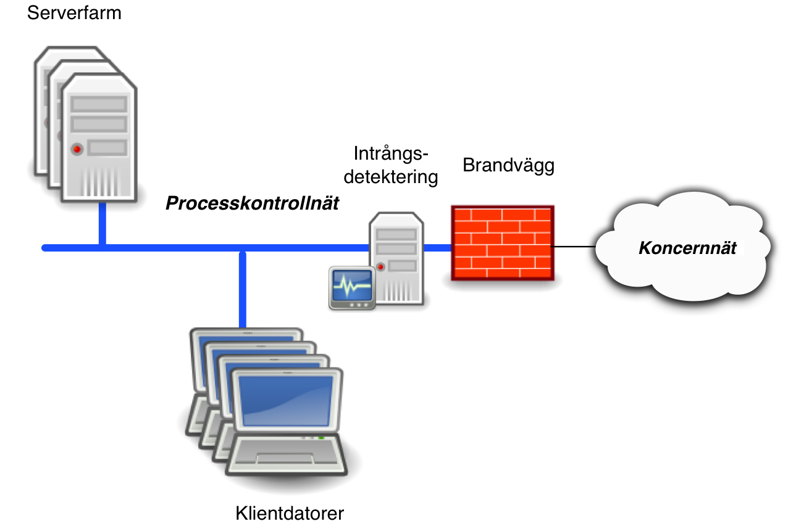

# Sammanställning av de olika servertyperna
Det här är en sammanställning av de olika varianter servrar som går att installera genom de guider och instruktioner för de olika avbilderna av installtionsmedia som skapats.

Alla installtionsmoment är gjorda så att själva installationen är så automatiserad som möjligt. 
För de installtioner där manuell konfiguration behövs är det antingen på grund av säkerhetsrelaterade skäl eller av den enkla 
anledningen att det måste ske en anpassning till den aktuella nätverksmiljön.

Nedan beskrivs på ett mer övergripande sätt de olika typer av tjänster och servrar som vi skapat inom projektet.

## Logginsamlingsserver

Den här servertypen är till för att samla in loggar(spårdata) från andra datorer. En loggserver är bra ur flera perspektiv,
den är mycket användbar både för felsökning och vid incidenthantering. Dessutom kan en dedikerad, extern loggserver vara
ett krav för att få en garanti på att ingen missbrukar en server. Det går att åstakomma genom att vanliga
serveradministratörer inte får åtkomst till den centrala logservern.

Det bör noteras att det är en enkel loggserver. Den klarar uppgifterna att ta emot och samla in loggar från några få eller 
många andra system som skickar logg via nätverket. Den ser också till att loggmeddelanden finns tillgängliga över tid
genom att spara ner dom på disk. För vissa ändamål kan det krävas en mer avancerat server för att kunna ha bättre
kontroll av de händelser som sker i en miljö. Dock så är den här serverinstalltionen en mycket bra start
ifall det inte finns någon central loggserver.

## Nätverksinspelningsserver

Den här servertypen är till för att på ett enkelt sätt kunna spela in nätverkstrafik och spara. För att spela in trafik så är det bara att koppla in en nätverkskabel till den nätverksport som inspelning ska ske. För att relevant trafik ska komma till den aktuella porten så behövs antingen en nätverkstapp eller en switch som är konfigurerad med en så kallad *monitoreringsport* eller *SPAN-port*.

## Larmserver

Den här servertypen är till för att kunna övervaka andra servar, andra infrastrukturkomponenter samt
de tjänster som finns på dem. Det kan till exempel vara för att upptäcka och larma om lagringsutrymmet
håller på att ta slut, att lasten på servern (hur nedtyngd servern är) är för hög, med mera.

Installtionen av servern i sig är automatisk, men för att funktionen skall kunna vara verkningsfull, så
krävs att den konfigureras mot den miljö som ska övervakas.

## IDS-server

Den här servertypen är till för att kunna agera på beteenden i nätverk, då den lyssnar på och analyserar
nätverkstrafik för att hitta signaturer eller mönster som tyder på intrång, policyöverträdelser, med mera.
Analysen av nätverket sker genom att servern ansluts på en sådan nättopologisk plats att den kan se nätverkstrafik där det finns behov av larm vid onormala beteenden.

## Brandvägg för SCADA- och ICS-miljö

För projektet så valdes brandväggen pfsense. Den är en mogen och beprövad lösning som sedan tidigare har en färdig paketering. 
Pfsense har också många säkerhetsfunktioner, exempelvis inbyggt stöd för skydd mot överlastningsattacker, loggning av trafik,
möjlighet att sätta upp i klustrat högtillgänglighetsläge, normalisering (tvätt) av överförda nätverkspaket, med mera.

På grund av att den sedan tidigare har en paketering, så har vi själva inte velat göra en massa dubbelarbete med att paketera den.
För den här servertypen har enbart en installation- och användareguide på svenska skrivits av progrektet. 

Nedanstående bild visar hur en brandvägg fungerar i princip. I datorsammanhang och i IT-säkerhetssammanhang så är en brandvägg
en kontrollfunktion med filtrerings- och spårbarhetsmöjlighet som styr datortrafik som passerar mellan olika nätverk. Bilden visar
att viss typ av trafik, den gröna pilen, släpps igenom brandväggen medans den brandgula pilen visar trafik som blockeras från att
passera brandväggen. Förekomsten av blockerad eller igensläppt trafik kan loggas och därmed bli spårdata som går att analysera,
sammanställa och göra rapporter eller statistik från.

Nästa bild visar principer för hur en brandvägg kan bestå av flera anslutningspunkter, där vissa mer okontrollerade nät finns på en sida,
ett internt nätverk - i detta fall ett processkontrollnät finns på den andra sidan vilket i detta fall kallas "insidan" och ett eller flera
såkallade DMZ-nät som sitter i den demilitariserade zonen.

I geografiskt utspridda organisationer, tillexempel elbolag med lokalkontor, olika anläggningar för distribution och produktion, med mera,
så kan det finnas behov av att installera flera interna brandväväggar för att dela upp nätverket i mindre delar, som har åtkomstbegränsingar 
från varandra. Nästa bild visar översiktligt behovet av att dela in ett koncernnät i olika delar, där de olika process-, ICS- eller SCADA-miljöerna
är utseparerade från det sammanhållande koncernnätet. Detta för att skydda processnäten från obehörig åtkomst eller misstag med IT-teknik som kan
påverka tillgänglighet och produktion.

Då det som sagt är en existerande paketering av pfsense som vi använder, så hämtas själva installtionsfilen ner från tillverkaren på adress [pfsensedl].

## Placering av de olika säkerhetslösningarna

Det finns många placeringar på vart i ett nät en komponent kan vara placerad. Vad som är rätt beror på hur det aktuella nätverket ser ut. Ibland kan det även vara bra att gör en ny design på nätverket för att uppnå bättre säkerhet. I exemplet nedan så används en fiktiv nätverksmiljö som inte är designad med säkerhet i åtanke för att visa på hur de olika komponenterna skulle kunna ge en bättre kontroll och säkerhet utan att påverka den aktuella designen.

Med en nätverksmiljö som den ovanstående beskrivna så är det möjligt att med relativt 
små medel, till exempel de gratisverktyg som erbjuds i den här paketeringen, att 
bygga in säkerhetskomponenter som kan bättra på säkerheten och kontrollen i nätverket 
avsevärt.

Kostnaden för att uppnå det förstärka skyddet, med hjälp av de extra komponenterna som och de extra skydd som dessa kan ge,
bör ställas i relation till arbetsinsatser och investeringar. Om man till exempel lyckas återanvända en redan existerande
dator, om gammal hårdvara återanvänds, och till detta lägger någon dag eller en veckas arbete, så kan det i många fall
anses vara en god investering som har potentialen att ge en myckt bra utdelning.

\clearpage
