# Installation

Detta kapitel beskriver närmare hur man installerar och sätter upp en server utifrån den programvara som skapats i projektet.

För att installera en av de olika typer av servrar som finnns tillgängliga så måste antingen skivavbildningen, den såkallade [iso]-filen,
av installationsmediet laddas ner från en distributionsserver. Eller, om du är en avancerad användare, så kan du bygga en egen avbild
från källkoden som också distribueras. Detta gäller som regel, men med ett undantag - brandväggen som nyttjats inom projektet har vi
inte gjort någon distribution av, utan den går istället att ladda ner från brandväggsprojektet pfsens egna webbplatser.

## Installera en server
Nedanstående flödesdiagram visar grafiskt översiktligt de olika stegen som behövs för att hämta programvaran, utföra de olika
momenten för att installera och konfigurerar servern samt börja använda den. Vi har i själva paketeringsarbetet förenklat och
automatiserad en massa saker, för att så få steg som möjligt skall behövas för att komma igång.

//TODO: Tanken från SvK var att ISO:n skulle finnas för nedladdning på energisakerhetsportalen. Det gör den dock inte. Schemat behöver uppdateras när metod för distribution har beslutats

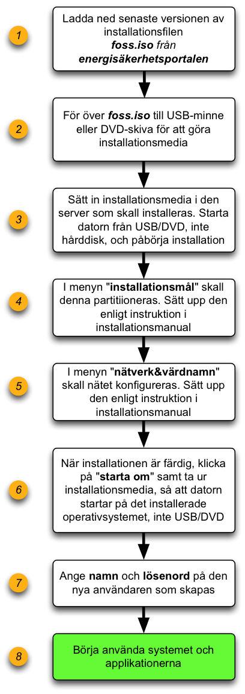

Första steget med att installera en server är att ha tillgång till själva installationsfilen, vanligtvis en så kallad [iso]-fil.
Information om var och hur installations-filen kan hämtas finns att tillgå på [energisakerhetsportalen].

För att installera en server måste datorn startas upp från antingen DVDn eller USB-stickan. Om du inte använder en fysisk server,
så kan det räcka med alternativet att direkt starta den virtuella servern från ISO-filen.

Om du behöver omvandla den hämtade filen till en USB-sticka eller en DVD-skiva, varifrån installationen görs,
följ instruktionerna för det som finns i kapitlet [Skapa installationsmedia].

För att starta datorn från den valda mediet så kan det räcka med att starta den direkt med mediet istoppat i CD/DVD-läsaren eller
i USB-anslutningen. Om du stöter på problem, så kan det bero på en mängd olika saker, exempelvis att

* datorn du försöker installera på är inställd att inte stödja att starta ifrån annat än hårddisken
* datorn inte vill starta från ett osäkert lagringmedia.

Sådana här inställningar kan justeras så att systemet istället startas från den nya temporära startdisken.
Ibland kan det behövas konfigureras i datorns inställningar för BIOS eller UEFI. Hur detta görs skiljer sig från
tillverkare till tillverkare och datorserie från datorserie. Se instruktioner från aktuell leverantör av datorn
hur detta sker med just den aktuella datorn.

### Installationsförfarande

OBS! I nedanstående beskrivning så är det enbart hårddiskinställningarna som *måste* sättas upp i första steget. Övriga inställningar går att ändra sedan.

Vid uppstart från mediet kommer en meny att visas med de olika installtionstyperna att visas enligt bilden nedan  

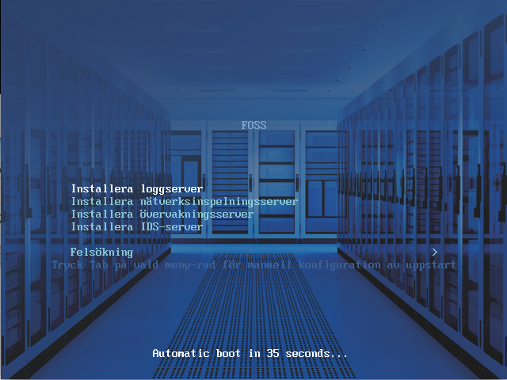  

  1. Med tangentbordets piltangenter går det att stega till den servertyp som ska installeras

  2. Efter vald servertyp är markerad, tryck på knappen *enter/return*

Datorn kommer nu att ladda installationen och efter en liten stund kommer nedanstående meny att visas där installtionsspecifika val kan göras  

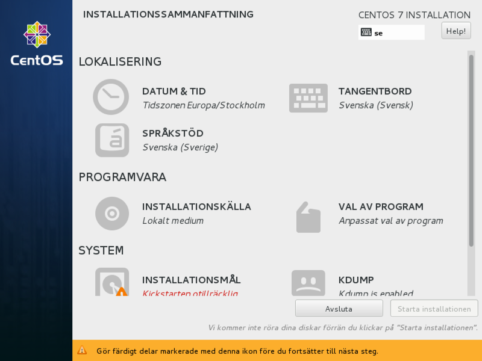

  3. Under rubriken **LOKALISERING** är det förvalt till Svenska men det är möjligt att ändra till ett annat språk om så önskas.  

  4. Under rubriken **PROGRAMVARA** är det också förvalt, dessa val ska **inte** ändras.

Beroende på den aktuella datorn och skärmens upplösning som används så kan hela bilden visas eller så kan den vara *skrollbar*  

  5. Längst ner finns rubriken **SYSTEM** och där **måste** val göras för att installationen skall kunna fortskrida.

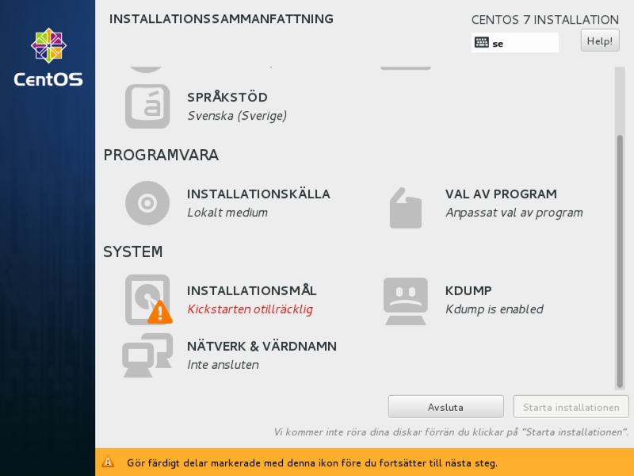

Som bilden visar, så är alternativet "installationsmål" markerat med ett frågetecken och en text om att de förinställda parametrarna som satts för installationen i övrigt inte gäller för detta alternativ. Installationsmålet är den eller de hårddiskar som skall användas som system- och startdisk när systemet väl installerats klart. För dessa hårddiskar så måste du manuellt gå in i installationverktyget och ändra vissa inställningar för hur du vill använda disken.

*OBS. Vi har valt detta alternativ - att installationen stannar och ber om manuella handgrepp av två orsaker. 1 - för att ge användaren en chans att bestämma om hur systemets diskar skall vara uppsatta. 2 - för att ge användaren en chans att ångra sig ifall det visar sig att något fel uppstått, exempelvis att installationen håller på och utförs på fel dator eller mot fel disk.*

  6. Klicka på **INSTALLATIONSMÅL**. Menyn i bilden nedan kommer då att visas  

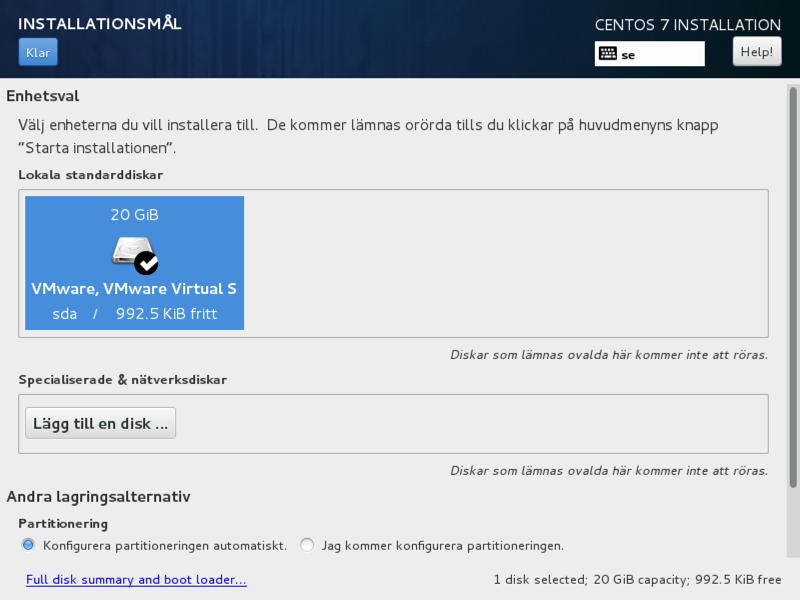

  7. Välj *den hårdisk* som installationen ska ske på. I exemplet på bilden så finns det en hårdisk i en virtuall dator som är vald.  

  8. Välj *klar* uppe i högra hörnet som partitioneringen ska ske automatiskt.  

För en mer avancerad installation kan en manuell partitionering vara ett bättre alternativ. Dock är det konfigurationsvalet utanför vad som beskrivs i den här installationsguiden.

  9. Om hårddisken inte är tom så måste det bekräftas att all data skrivs över genom att klicka på knappen *Återvinn utrymme*. Om det görs så kommer tidigare data att skrivas över och den infomrationen kommer inte att kunna återskapas

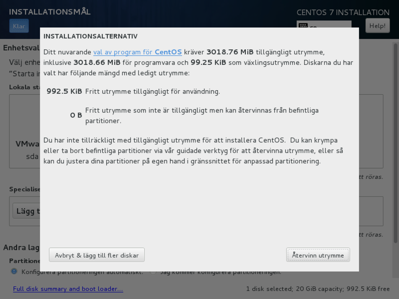

Efter att du valt återvinn utrymme, så kommer det dyka upp ytterliggare en dialogruta, som ser ut som nedanstående exempelbild

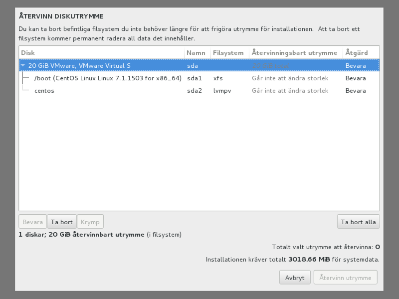

  10. I denna meny välj *Ta bort alla* för att kunna göra en ny installation på hårddisken  

  11. Välj sedan *Återvinn utrymme*

Nu är valet för att sätta upp hårdisken för installation klar. Du kommer därefter tillbaka till huvudmenyn.

Väl tillbaka till den första menyn så måste även nätverksinställningar ställas in innan installationen kan påbörjas

  12. Välj menyn **NÄTVERK & VÄRDNAMN**

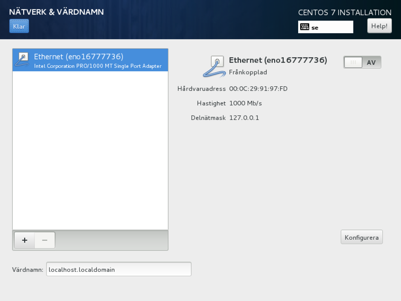

  13. I den här meny måste nätverkskortet aktiveras genoma att klicka på *av*-knappen. Nätverkskortet blir nu aktiverat men ip-address måste också konfigureras.

*OBS. Den här menysidan kan vara något annorlunda än den förevisade bilden, främst om ett nätverkskort saknas i datorn eller om en nätverkssladd inte är ansluten. Om den är annorlunda, felsök för att hitta felet så du kan installera färdigt nätverksinställningarna.*

  14. Om datorn tillhör en specifik domän så sätts den tillsammans med datorns egna namn i rutan **Värdnamn**

  15. Klicka på knappen **Konfigurera** för att konfigera IP-addresser

En meny kommer fram där det finns flera flikar att välja beroende på konfiguration som behövs utföras för att servern ska fungera i det aktuella nätverket där den ska användas  

  16. I fliken **Inställning för IPv4** går det att sätta IPv4 addresser  

Antingen kan automatisk vara påslagen om DHCP används, då behövs det ingen konfiguration eftersom det är förvalt  

  17. Om en fast IP-address ska användas så ska metod ändras till *Manuell* enligt bilden nedan, endel installationstyper kräver att det åtminstonde är konfigurerat med en s.k. *link-local* address.

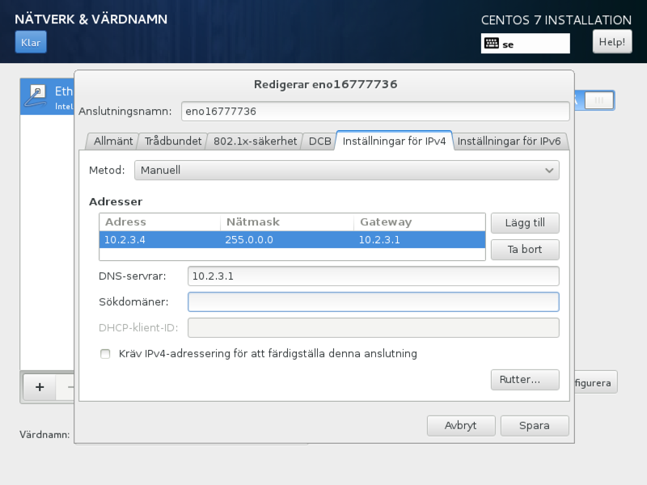

I tabellen **Adresser** ska sedan ip-address information skrivas in enligt följande  

  A. **Adress** sätts till den ipaddress som ska användas
  B. **Nätmask** sätts till den nätmask som ska användas i det aktuella nätverket
  C. **Gateway** sätts till den *gateway* / *default route* som behövs om kommunikation ska ske till andra ipnätverks än det lokala för den aktuella nätmasken

Om DNS används så skrivs namnservrarnas ipaddresser in i rutan **DNS-servrar**  
När alla val är klara så avslutas det med att klicka på **SPARA** knappen

  18. I fliken **Allmänt** går det att välja om den aktuella konfiguration ska vara aktiverad efter uppstart. Klicka därefter på knappen *spara*.

Markera checkrutan som heter *Anslut automatiskt till detta nätverk när det är tillgängligt* enligt bilden nedan om konfigurationen som är satt ska vara aktiv när datorn startar.

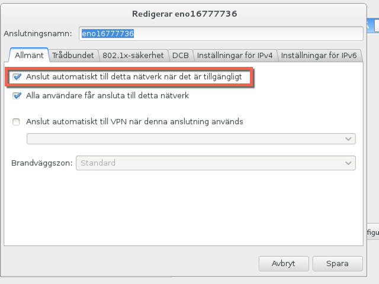

Om den aktuella datorn har flera nätverkskort så behöver konfiguration av all nätverkskort ske om alla ska ha nätverksfunktionalitet aktiverat vid uppstart

När alla val för ipkonfigurationen är klara så avslutans konfiguratione genom att klicka på knappen **KLAR** i övre högra hörnet  

Nu är alla val gjorda och installationen kan påbörjas.  

**OM DET FINNS NÅGON DATA LAGRAD PÅ HÅRDDISKEN SOM ÄR VALD FÖR INSTALLATIONEN SÅ KOMMER DEN ATT SKRIVAS ÖVER OCH DET ÄR INTE MÖJLIGT ATT ÅNGRA ELLER ÅTERSKAPA DET**

Klicka på **Starta installationen** för att installera den valda servern  

Installationen kommer nu att starta och en ny meny kommer att visas enligt bilden nedan

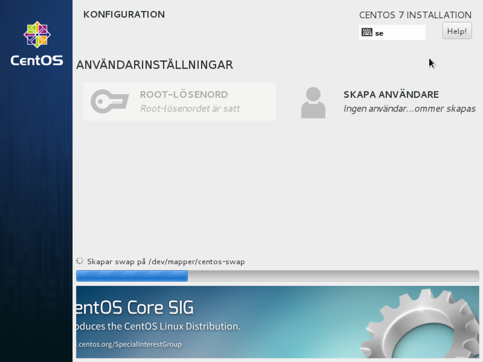

Det finns två menyval i den här vyn och den ena knappen går inte att trycka på.  
Det är knappen för att sätta root-lösenordet, dvs säga lösenordet för att få högsta behörighet på datorn. Lösenordet är hårkodat till *toor* under installationen men kommer att ändras till ett slumpmässigt valt lösenord under installationens slutfas. Det sker med kommandot *pwgen -1 48* vilket skapar ett slumpat lösenord på 48 tecken. För att få högre behörighet eller ändra root-lösenordet så kan kommanot *sudo* användas enligt de instruktioner som beskriver hur terminalen fungerar efter att installationen är slutförd.  

Det andra menyvalet är till för att skapa användarkonton, det ska **inte** göras i det här skedet utan sker efter att installationen är slutförd.  

Nu är det bara att vänta på att installationen slutförs.  
När den är klar så kommer en knapp med texten *Starta om* visas enligt bilden nedan.  

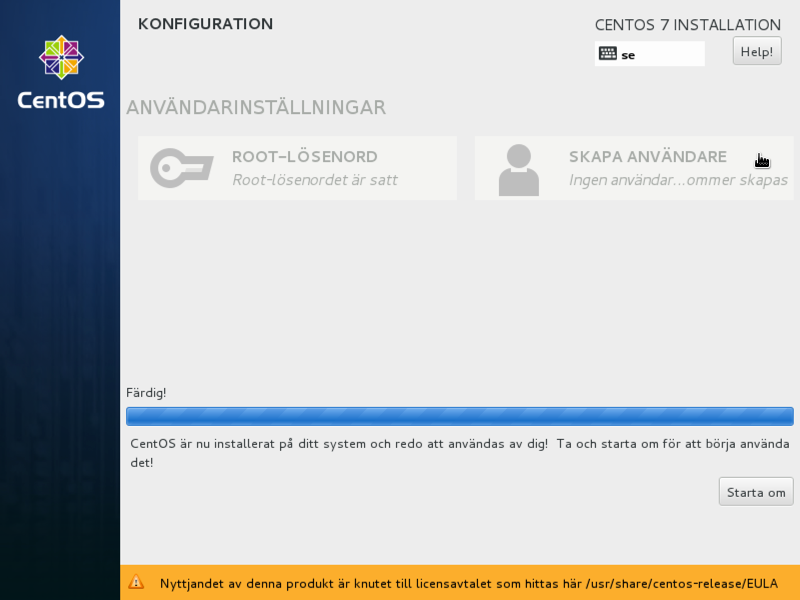

Kicka på knappen starta om och ta bort installtionsmediet när datorn har startat om så att inte installationsmeny startar igen.  

När datorn kommer att ha startar om så kommer den att visa några grafiska fönster där de sista valen måste göras.  

När datorn startats om så kommer en bootmeny visas en kort stund där olika varianter av avancerad
uppstart kan utföras. Dessa avancerade ändringar ligger dock utanför det installationsförfarande som
den här dokumentationen dokumentationen beskriver. Menyn kommer att försvinna och en ny välkomstmeny kommer att komma fram enligt bilden nedan.  

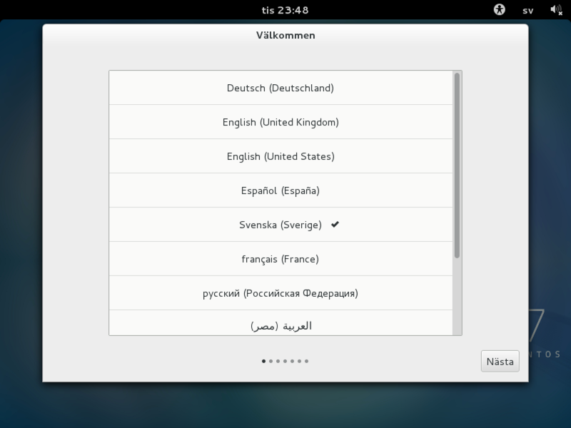

I det första steget kan språkvalet än en gång konfigureras, svenska är förvalt och det går bra att klicka på **Nästa** för att fortsätta.

I denna meny går det att välja tangentbordstyp.

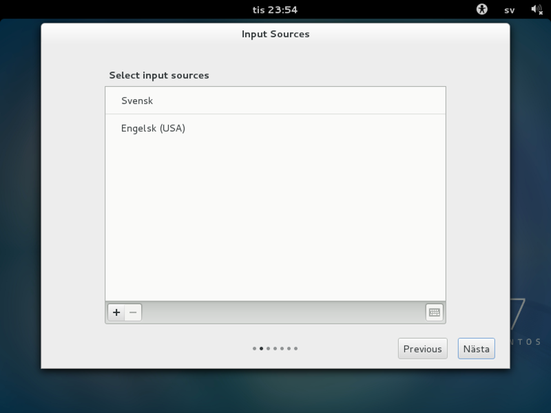

Svenskt [qwerty] tangentbord är förvalt och det går bra att klicka på **Nästa** för att fortsätta.  

Nu är det dags att skapa ett användarkonto för att kunna använda servern.  

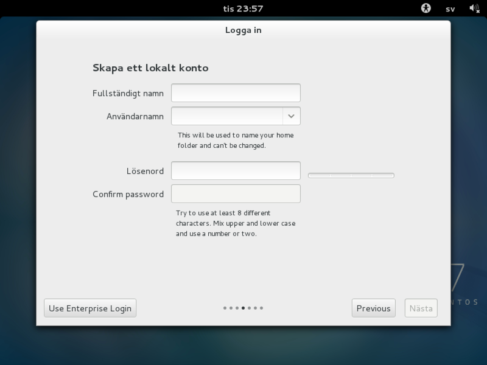

Fyll i samtliga rutor för att skapa ett konto och tillhörande lösenord  

  * **Fullständigt namn** är det beskrivande namnet för konto som skaps
  * **Användarnamn** är det namnet som används vid inlogging till servern
  * **Lösenord** är det lösenordet som används för att logga in med det valda användarnamnet. Lösenorder ska vara svårgissat och slumpat med komplexitet samt kvantitativt så ingen obehörig kan gissa sig till lösneordet eller både manuellt och programatiskt kunna pröva sig fram till korrekt lösenord
  * **Confirm password** Samma lösenord som matades in i *Lösenordsrutan* ska fyllas i här för att försöka verifera att det valda lösenordet inte har stavats fel.
Efter kontovalen är gjorda går det bra att klicka på **Nästa** för att fortsätta  

I den nya menyn går det att välja lokaltion enligt bilden nedan  

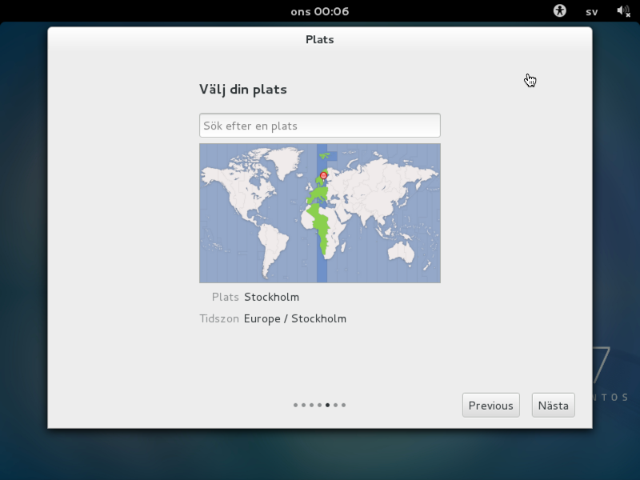

Stockholm är förvalt och det är det enda valet som går att välja om Sverige ska väljas. Det här valet är främst till för att sätta den tidszon som ska användas.

Det går bra att klicka på **Nästa** för att fortsätta.  

Om datorn är konfigurerad med åtkomst till Internet så går det att koppla den till molntjänster enligt bilden nedan.

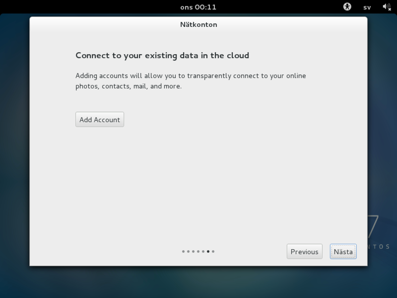

Här behövs inga molntjänster och det går bra att klicka på **Nästa**

Installationen är nu klar.

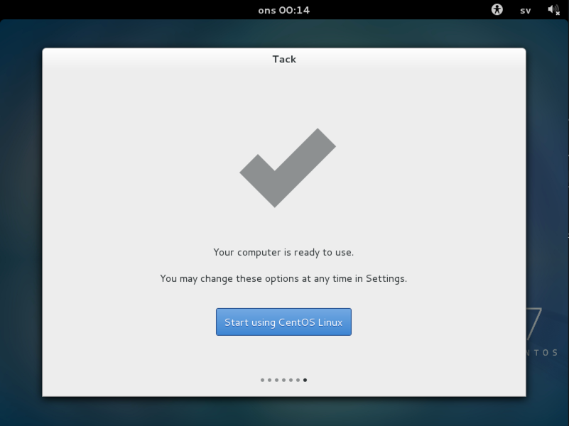

Starta den aktuella server som nu är färdiginstallerad genom att klicka på knappen **Start using CentOS Linux**  

Nu är allt klart och det går att börja använda eller ytterliggare konfigurera den aktuella serverinstallationen enligt vidare instruktioner för aktuell installation.
Den användare som skapades är redan inloggad.  

[iso]: https://sv.wikipedia.org/wiki/ISO-avbild "En strukturerad fil som innehåller alla filer sammanställda till en stor sammanslagen fil, vilket är en avbildning av en CD/DVD-skiva"

\clearpage
