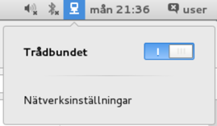
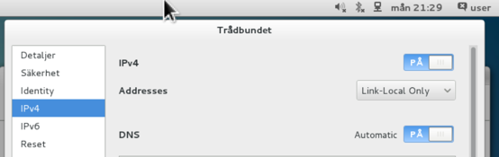
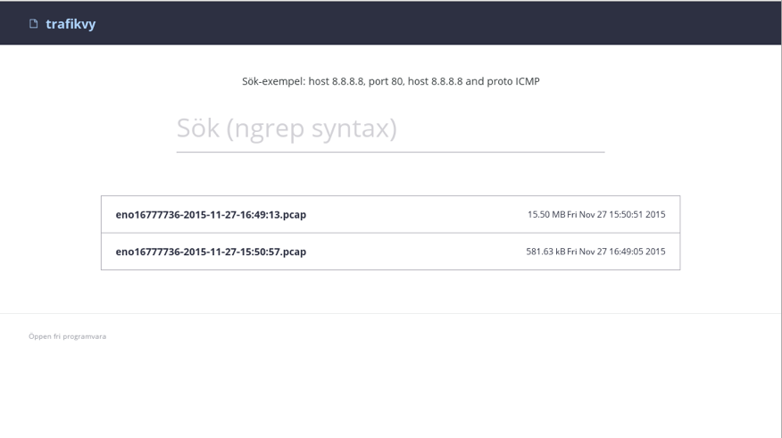

# Nätverksinspelningsserver

Detta kapitel beskriver en server med en särskild säkerhetsfunktion - 
att kunna spela in och spara nätverkstrafik som den ser via de nätverksanslutningar den har.

Servern är en speciellt för funktionen uppsatt Linuxserver som enbart fungerar som nätverksövervakare. 

Det här kapitlet går närmare in i hur tjänsten installeras, hur man använder nätverksinspelningarna, ger 
förslag på hur detta kan användas för att förbättra säkerheten i ett SCADA/ICS-nät, med mera.

## Översikt

Nätverksinspelningsservern är en tjänst som används för att spara
nätverkstrafik från alla nätverksinterface som servern är ansluten med, det sker med hjälp av [NetworkManager]. Det går
att tänka på den som en eller flera övervakningskameror som är riktad mot ett visst objekt - nätverk. När det händer något 
på nätverket, så spelas det in och sparas på serverns hårddisk.

Den inspelade nätverkstrafiken har flera möjliga användningsområden:

  * Vid felsökning av system, applikationer eller nätverk, så går det att undersöka inspelad trafikdata.
  * Vid en IT-incident går det att gå tillbaka i tid och undersöka olika händelser, genom att analysera nätverksinspelningen som gjorts vid den aktuella tidpunkten för att se om det går att hitta någon relevant trafik i relation till incidenten.
  * Vid prestandaproblem går det att se vilka nättjänster som nyttjar nätet, hur mycket nätverket används, etc.

## Installation av nätverksinpelningsserver

Installationen är till största del automatiserad och enbart ett fåtal steg måste utföras för att få en fullt fungerande nätverksinspelningsserver.

  1. Starta datorn från installationsmediet som skapast enligt [Skapa installationsmedia]
  2. Installera nätverksinspelningsservern genom att följa instruktionerna i [Installation].
  
Under installationen av nätverksinpelningsserver går det att konfigurera nätverkskortet direkt med en [link-local] address för att inte behöva göra den inställningen enligt de instruktioner i kapitlet [Nödvändiga inställningar]
Dessutom går det att konfigurera nätverksinställningarna att automatiskt aktivera nätverkskortet vid uppstart som det beskrivs i installationsguiden. Om båda inställningarna görs behövs kapitlet [Nödvändiga inställningar] utföras.
  
Notera att beroende på var servern placeras så kan mängden data som sparas bli mycket stor. Därför rekommenderas att välja 
en större installationsdisk än vad som är normalt för en server så att trafikdata kan sparas så länge som möjligt. När disken blir
80% full börjar de äldsta inspelningarna automatiskt raderas.

Det går att montera en till disk för sparande av trafikdata men då måste de existerande [SELinux]-reglerna beaktas då de är inställda så
att [tcpdump] enbart kan skriva i **/home/tcpdump/**.

## Nödvändiga inställningar

Efter en installation behöver de nätverkskort där trafik ska dumpas aktiveras i [NetworkManager]. Det görs 
enklast genom menyn uppe i högra hörnet.



Det räcker att ställa in *Link-Local Only* på det önskade nätverkskortet för att det ska fungera. Det bör inte sättas en
IP-address på nätverkskortet då det är säkerhetssynpunkt är bra att maskinen inte är nåbar från andra nätverk.



## Användning

Det här kapitlet går närmare in på hur man använder sig av nätinspelningsserverns olika möjligheter.

### Sökning i inspelad nätverkstrafik

En använbar funktion är att kunna söka efter textsträngar i den nätverkstrafik som spelats in.

Genom att starta webbläsaren och gå till URL <http://127.0.0.1/sok.html> så går det att söka i de 
existerande nätverksdumparna direkt på servern. Hur denna sökfunktion ser ut går att se på nästa bild.



Bakom kulisserna så använder sig sökfunktionen av verktyget [ngrep], ett program för att kunna tolka
innehållet i nätverksinspelningar, för att kunna välja ut de dumpar som är intressanta.


### Analys av inspelad nätverkstrafik med Chaosreader

När en inspelad trafikdump valts ut, så går det sedan att antingen packa upp den direkt på servern
med hjälp av verktyget [Chaosreader] som kan förstå nätverkstrafik, och titta på den med webbläsare.

Nedanstående bild visar hur det ser ut i webbläsaren när man får upp en lista över filer med 
inspelad nätverkstrafik. På bilden så klickar vi på knappen "packa upp" för att ta upp och
visa filinnehållet i verktyget *Chaosreader*.


Nästa bild visar hur det ser ut i webbläsaren när chaosreader har analyserat den inspelade
nätverkstrafiken och visar upp en lista över trafikdata och nätverksströmmar.


Nästa bild visar en detaljvy när verktyget ChaosReader har avkodat nätverkstrafiken och visar 
upp den i webbläsaren. I exemplet ser vi hur en HTTP-ström har avkodats och vi ser den blåa frågan
och den röda färgen som är satt på svaret.


Det går också att hämta hem hela trafikdumpen och använda andra verktyg på en lokal dator t.ex. [Wireshark], för att göra
en annan analys.

### Analys av inspelad nätverkstrafik med Wireshark

En annan metod för att avkoda inspelad nätverkstrafik är att använda verktyget [Wireshark], 
som har stöd för att tolka många olika nätverksprotokoll på detaljnivå. Verktyget Wireshark 
medföljer paketeringen.

Nästföljande bild visar var i menyerna man hittar verktyget Wireshark.


Nedanstående bild visar när verktyget Wireshark har startats igång och använts för att avkoda nätverkstrafik.


Nedanstående bild visar filväljaren. Notera den röda rektangeln som visar var någonstans i filträdet som filerna
finns undansparade, dvs */home/tcpdump/*. Du måste gå runt i filträdet för att komma dit och lista filerna.
 


Nedanstående bild visar när filen med den inspelade nätverkstrafiken är inläst i verktyget wireshark. Här man nätverkstrafiken
analyseras i detalj.


*Det bör noteras att den version av wireshark som finns tillgänglig för CentOS är 1.10. Den senaste versionen av wireshark,
som precis släppts men ännu inte är tillgänglig som en del av centos standardpaket är version 2.0. Version 2 har en 
del förbättringar i stödet av avkoda protokoll, inte minst vad det gäller möjligheten att avkoda Siemens S7-protokoll.*

## Detaljbeskrivning

Denna server använder verktyget [tcpdump] för att spela in trafik på de nätverksinterface
som är uppe enligt [NetworkManager]. När [NetworkManager] märker att ett interface
är uppe triggas ett event som i sin tur får [Systemd] att starta en tcpdump-instans
på det interface som kom upp.

En konsekvens av detta är att en inspelning avslutas, och sparas ner till en färdig fil, 
i samband med att nätverksinterfacet stängs ner, exempelvis med att man rycker ut en nätverkskabel.
Detta kan vara bra att känna till i händelse att man direkt vill kunna analysera senast inspelad
trafik.

### Vart inspelad nätverkstrafik sparas

De inspelade nätverkstrafik-dumparna hamnar i filkatalogen **/home/tcpdump/**. För att filstorlekar
som skall öppnas i analysverktyg skall ha en hanterbar storlek så är inspelningsfunktionen satt att
hacka upp inspelad nätverkstrafik i filer av fix storlek. Det innebär i praktiken att inspelningsfiler
roteras automatiskt när de blir 100MB stora. 

Namnet på loggarna följer mönstret

```
	interface-datum-och-tid-när-interfacet-kom-upp.pcap 
```
och när de roteras adderas en siffra på namnet. 

T.ex skulle en fil som heter *eno77744-2016-01-01.pcap* bli *eno77744-2016-01-01.pcap1*.

### Hur hanteras gamla nätverksinspelningar?

Ett skript som vi utvecklat och som används för att bättre kontrollera insamlade filer vid namn *reaper.py* 
körs vid start och ansvarar för att partitionen där dumparna läggs alltid har plats över för att kunna rotera en dump. 
Blir hårddisken full, tar reaper-skriptet bort de äldsta filerna automatiskt. Med andra ord ska denna server
kunna stå igång i flera år utan att någon ska behöva logga in och rensa bort gamla dump-filer för att hårdisken blivit full.

### Säkerhet för att skydda systemet från angrepp och fel i inspelningsfunktionen

Säkerhetsmekanismen *[SELinux]*, ett sätt för att med hårda säkerhetsinställningar som styr ett exekverande
program, används för att låsa ner *tcpdump* så att detta inte kan skriva någon annanstans än just under
filkatalogen **/home/tcpdump**. Detta är ett sätt att kunna försäkra sig mot att eventuella gömda eller
framtida säkerhetshål i tcpdump kan missbrukas och bli till säkerhetsproblem mot själva servertjänsten.

### Säkerhet för att skydda systemet vid läsning av inspelad trafik

En webbserver, [lighttpd], är igång och nedlåst med *[SELinux]* så att den enbart
ska kunna läsa i **/var/www** och i **/home/tcpdump** där de inspelade nätverksdumparna ligger.

## Avancerat, nästa steg

Om servern ska spela in en stor mängd trafik kan det vara möjligt att *tcpdump* inte räcker till. 
Då rekommenderas det att byta till [Netsniff-NG] som följer med installationen. Om netsniff ska användas är det möjligt att ändra i
skriptet som startar *tcpdump* i **/etc/NetworkManager/dispatcher.d/99-tcpdump**.


Önskas en "live" bild av trafiken kan man installera [ntop]. Med det verktyget kan
man lättare få en bild av nätverkstrafiken vid tillfället. Samma project har även flera andra
verktyg som kompletterar och som ibland kan ersätta de verktyg som är installerad på denna server.

### Åtkomst till webbgränssnitt via nätverket

Som standard så går webbgränssnittet enbart att nå via den egna datorn, via lokalt ansluten 
skärm och tangentbord. När servern kommer igång så startar det grafiska gränssnittet lokalt. 
Via denna grafiska miljö kan man via en lokalt startad webbläsare komma åt gränssnittet.
Det går alltså inte att nå webbtjänsten direkt via nätverket. Orsaken till detta är att
standardinstallationen skall vara så säkert uppsatt som möjlig.

Om det finns behov av att kunna nå nätverksinspelningsservern från en annan dator måste
konfigurationen för webbservern ändras så att den även är åtkomlig på det externa nätverksinterface.
Då måste kryptering av webbtrafiken samt authenticering av åtkomst till webbsidan aktiveras. 
Detta behövs för att skydda den potentiellt känsliga trafiken inte kan ses av någon obehörig,
eller att serven kan nås av, och loggas in i, av någon obehörig.

Vid första uppstarten av systemet genererades *för installationen unika* så kallat "dummy-cert" för webbservern.
Dessa certifikat finns sparade i filerna **/etc/pki/tls/certs/dummy.cert** och **/etc/pki/tls/private/dummy.key**.
Dessa certifikat kan användas i test-syfte. Om du vill testa att aktivera nätverksåtkomst till
webbtjänsten så kan du undersöka den existerande konfigurationsfilen **/etc/lighttpd/lighttpd.conf**. 
Där finns ett utkommenterat exempel på hur det är möjligt att aktivera en server som dels lyssnar på en 
extern address och dels använder kryptering för att skydda trafiken. För att kunna redigera filen, 
för att ta bort kommenteringen och kanske sätta en annan IP-adress,  starta programmet
*Terminal* via menyn "Applications". I det öppnade terminalfönstret skriv kommandot:

```
   	      sudo nano /etc/lighttpd/lighttpd.conf
```

Där nano är namnet på ett textredigeringsprogram som medföljer. Använd nano, vi eller mg efter önskemål. 
*För hjälp att förstå hur man använder textredigeringsprogram eller hur man använder sig av terminal-programmet, 
se närmare detaljinformation i kapitlet [Terminal-åtkomst och kommandoraden].*

Förutom att aktivera nätåtkomst till webbserverdelen samt aktivera TLS-kryptering, så måste också
brandväggen öppnas. Liknande redigeringen av webbserverkonfigurationen ovan, så finns det redan utkommenterade
brandväggsinställningar för att underlätta för öppnandet av brandväggsportar och åtkomst till webbservern.
Starta programmet *Terminal* från menyn "Applications". Ta bort kommentarstecknet för raden med
hänvisning till *HTTPS* i filen **/etc/sysconfig/iptables**. Gör det med textredigeringsprogram enligt nedanstående
exempel:

```
   	      sudo nano /etc/sysconfig/iptables
```

När brandväggsreglerna är ändrade och nedsparade, ladda sedan om brandväggsreglerna med
kommandot 

```
 	      sudo iptables-restore /etc/sysconfig/iptables
```

\clearpage
