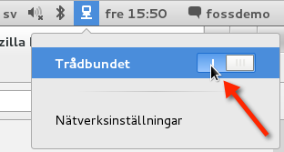
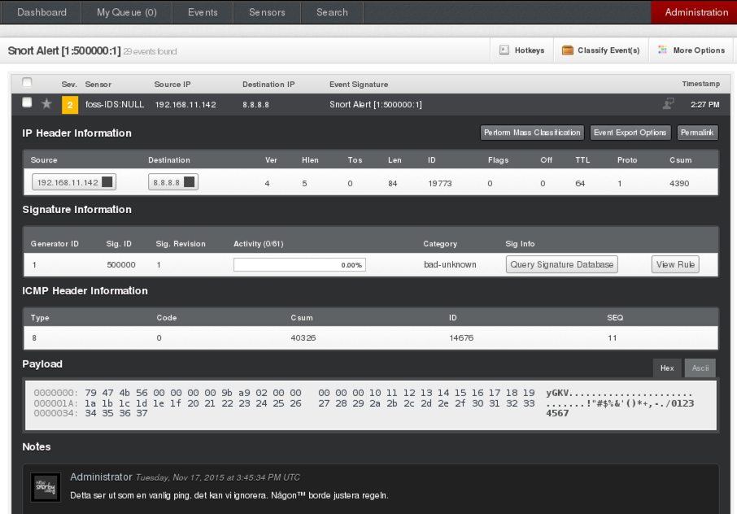
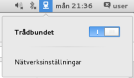
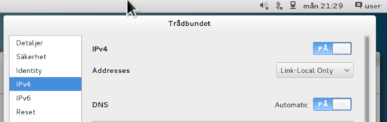
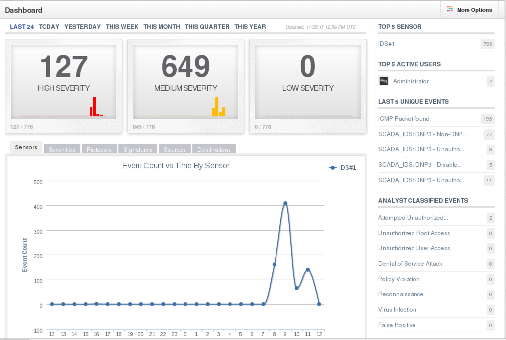
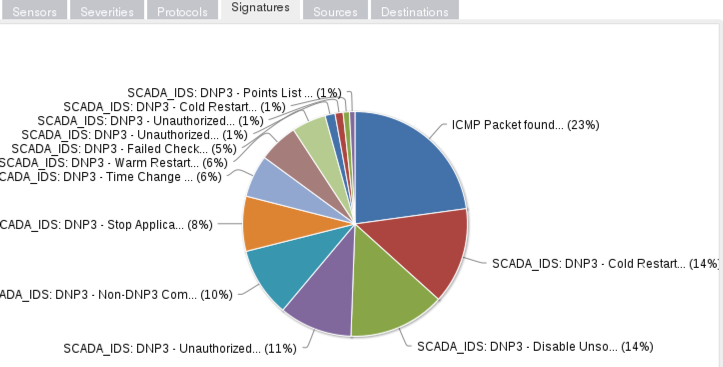
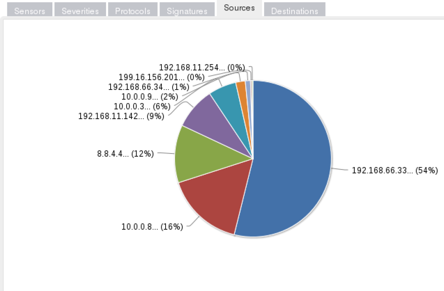
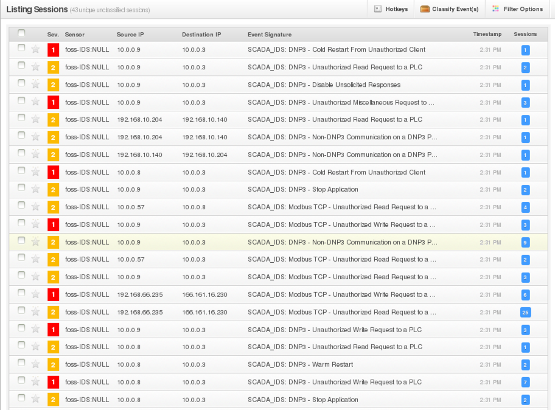
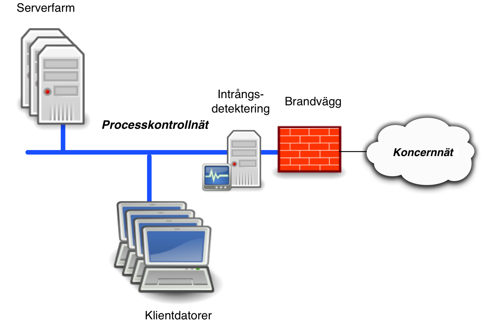

# IDS server

## Översikt

IDS står för Intrusion Detection Service, intrångsdetektering, vilket är en övervakningsfunktion med
fokus på säkerhet som reagerar på mönster som tyder på att ett intrångsförsök gjorts eller att ett
intrång lyckats. IDS-servern används för att automatiskt undersöka all trafik på de nätverksgränssnitt
som är aktiva, och den söker efter otillåten nätverkstrafik eller misstänkt nätverkstrafik.

Som regel är ett nätverksgränssnitt aktiverat i samband med att servern installerats. Detta nätverksgränssnitt kan ändras och det går att aktivera andra gränssnitt med hjälp av systemverktyget
[NetworkManager].



Om IDS-systemet upptäcker trafik enligt uppsatt regelverk, sparas information om detta i en
databas. Dessa varningar kan sedan studeras, kommenteras och klassificeras med en webbläsare.



## Installation av IDS server

Installationen är till största del automatiserad och enbart ett fåtal steg måste utföras för att det ska vara möjligt att börja använda IDS-servern.

  1. Starta datorn från installationsmediet som skapats enligt [Skapa installationsmedia]
  2. Installera nätverksinspelningsservern genom att följa instruktionerna i [Installation].

Under installationen av nätverksinpelningsserver går det att konfigurera nätverkskortet direkt med en [link-local]-adress för att inte behöva göra den inställningen enligt instruktionerna i kapitlet [Nödvändiga inställningar]

Dessutom går det att konfigurera nätverksinställningarna att automatiskt aktivera nätverkskortet vid uppstart som det beskrivs i installationsguiden. Om båda inställningarna görs behövs nätverkskonfiguration i kapitlet [Nödvändiga inställningar] inte utföras.

## Nödvändiga inställningar

Efter en installation behöver de nätverkskort där trafik ska övervakas aktiveras i [NetworkManager].
Det görs enklast genom menyn uppe i högra hörnet.



Det räcker att ställa in *Link-Local Only* på det önskade nätverkskortet för att det ska fungera. Sätt helst inte en IP-adress på nätverkskortet eftersom det av säkerhetsskäl är bra att maskinen inte är nåbar från andra nätverk.



För att säkerställa att allt är korrekt uppsatt finns enkla regler i **/etc/snort/rules/community.rules** som loggar
om en vanlig **[ping]** ses. Med andra ord räcker det att generera en händelse som ska synas genom att sända ett **[ping]** på nätverket där
IDS-servern är inkopplad. När det är verifierat kan reglerna kommenteras ut eller raderas helt för att inte generera onödiga händelser.

## Användning

Denna installation använder sig av [Snort], [Barnyard2] och [Snorby]. Snorby är en webbapplikation där man kan studera
de rapporter som [Snort] har larmat om och sedan kommentera dessa.

Som standard är Snorby enbart tillgängligt på den lokala maskinen och inte över nätverket. På <http://127.0.0.1:81/> går det
att logga in med de kontouppgifter enligt nedan som följer med en Snorby-installation. Första gången en användare använder gränssnittet via en webbläsare kommer det att ta en liten stund för programmet att automatiskt konfigureras färdigt.

  * Användarnamn: ** snorby@example.com**
  * Lösenord: **snorby**

*OBS: Kontot måste givetvis ändras till ett med ett säkert lösenord som inte är känt av andra.*

## Snorby

Nedanstående skärmbild är förstasidan i Snorby efter inloggning. Förstasidan ger en bra översikt över antalet
händelser som skett över tid både med grafer och med vissa nyckeltal. Siffrorna som visas
uppdateras automatiskt var 10:e minut.




I vissa fall kan det hända att värdena inte uppdateras.
Den problematiken går att lösa genom att gå till "Administration", "Worker & Job Queue", radera *SensorCache-jobbet* och sen lägga till ett sådant jobb igen.

### Vyer i Snorby

I snorbys översiktsvy går det se en mängd olika saker. Det går även att titta på insamlat data genom att välja olika flikar, exempelvis:

* *Signatures-fliken* visar vilka regler som träffat mest .
* *Sources-fliken* visar vilken IP-adress det är som orsakat de flesta händelserna.
* *Destinations-fliken* visar vilken IP-adress det är som blir mest attackerad-
* *Sensors-fliken* är mest intressant om flera sensorer används vilket vi inte beskriver i denna guide.
* *Severities* och *Protocols* delar upp händelserna i allvarlighetsgrader och nätverksprotokoll.

I nästa skärmbild visas ett cirkeldiagram som beskriver fördelningen över hur de olika reglerna med signaturer
har blivit träffade. Diagrammet beskriver i procent hur olika regler har matchat de nätverkspaket som inhämtats.



Nästa skärmbild visar ett annat cirkeldiagram som beskriver fördelningen mellan de olika käll-IP-adresser som
förekommer bland den nätverkstrafik som fångats upp. Den här vyn ger snabbt en översikt över vilken eller vilka
som är de vanligast förekommande IP-adresserna som ger upphov till IDS-larm.



Nedanstående lista är ett exempel på hur Event-sidan kan se ut om attacker utförs mot **ICS/SCADA**-system.
Bland reglerna som larmar syns att någon försökt skicka Modbus-trafik och DNP3-trafik in mot nätet:



## Placering

För att fungera på rätt sätt måste IDS-servern anslutas till ett nätverk. En IDS-server bör nättopologiskt
placeras på platser i nätverk där det behövs insyn i vad som pågår i nätverket.
Det vill säga, inkopplingen i nätet kommer att påverka vad sensorn kan se och analysera. Inkoppling
måste ske efter viss eftertanke och planering. Det här avsnittet handlar om detta.

En slutsats efter planeringen kan vara att man vill ha flera IDS-system anslutna till nätverket, placerade
på olika platser. En IDS kan vara placerad på kontorsnätet/koncernnätet, andra IDS kan vara placerade på
automations- och processnätverk. Ytterligare anslutningspunkter kan vara i nät som sitter i perimetern
mellan den egna organisationen och omvärlden, till exempel mot partneranslutningar eller mot Internet.



Placeringen kan dock ha en avsevärd inverkan på hur mycket nätverkstrafik, och därmed potentiella angrepp eller
trafik med mönster som matchar regelverket, som kan infångas. Placeras ett IDS-system på Internet så kan det
exempelvis leda till att en mängd trafik är skräp eller attacker som inte är relevanta, inte avser att riktas mot organisationen, med mera infångas.

Resultatet av IDS-systemets infångande och analys beror förutom själva den nätverksmässiga anslutningen också
på hur IDS:en är uppsatt och vilka regler och filter som är aktiverade i den. De *snort*-regler som bör vara
aktiverade är sannolikt väldigt annorlunda beroende på om IDS-servern är inkopplad i ICS/SCADA-nätverket,
mellan kontorsnätet och ICS/SCADA-nätet eller direkt efter brandväggen ut mot Internet.

## Detaljer

För att analysera nätverkstrafiken används [Snort] som är ett välkänt program för analys. Dess rapporter importeras sedan av [Barnyard2]
till en [MySQL]-databas. Därefter används en webbapplikation som heter [Snorby] för att studera och gruppera rapporterna.

Snorby körs av en modul till webbservern som heter [Passenger] vilket är en Ruby Applikationsserver.

[SELinux] används för hindra att en sårbarhet i någon av de installerade komponenterna kan utnyttjas för att ta kontroll över systemet.

## Avancerat, nästa steg

För att webbapplikationen ska kunna utnyttjas maximalt bör rapporterna studeras och Snort-reglerna anpassas efter den verksamhet som bedrivs. Snort-reglerna finns i
katalogen **/etc/snort/rules/** på systemet.

I den här installation är **IDS/SCADA**-regler från <https://github.com/digitalbond/quickdraw/> installerade. De kan behöva justeras för att passa en specifik miljö. Reglerna använder bland annat variabler för servrar och klienter som bör sättas i **snort.conf** för att de ska larma vid rätt händelser.

Reglerna utvecklades ursprungligen av Digital Bond och på deras hemsida finns det några fler regler med en annan licensiering som kompletterar de ovanstående reglerna: <https://www.digitalbond.com/tools/quickdraw/>.

### Anslutningsmetod

IDS-systemet kan vara anslutet mot nätverket på ett av flera sätt. Till exempel genom att sitta på en port i en hub, där all trafik
skickas till alla nätverksportar. Nätverksutrustning av hub-typ är inte speciellt vanligt förekommande nuförtiden, men skulle
kunna förekomma i vissa äldre automations- och processnätverk.

I modernare nätverk av typen Ethernet brukar man använda så kallade switchar. Dessa skickar inte ut alla
nätverkspaket på alla portar, utan har mer intelligens om vilken utrustning som sitter ansluten
till vilken port, och skickar därför bara ut relevant trafik till relevanta anslutningsportar. De flesta
mer kapabla och avancerade switchar brukar ha möjlighet att sätta en anslutningsport i så kallat
"span" eller "speglingsläge", vilket gör att trafik från en, flera eller alla portar skickas vidare
till denna speciella span- eller speglingsport. Denna inställning används för felsökning eller för
olika typer av säkerhetsutrustning.

En tredje anslutningsmetod är att inte koppla in IDS-systemet till en switch, utan att använda en nätverks-tap, för att
via en speciell anslutning kunna hämta ut trafikdata. Det finns flera fördelar med att använda tap:ar i stället för
att ansluta via switchportar, bland annat att man minskar risken att data går förlorad och att nätverkspaket inte
förvanskas eller påverkas av switch-utrustningen.

### Att lägga till nya regler

Det finns även lite mer allmänna regler för att upptäcka elakheter som går att ladda ner från <https://snort.org>. Dock behövs det en registrering (som är kostnadsfri) för att få komma åt dessa, vilket är anledningen till att de inte finns med i denna installation.

Oavsett vilka regler som laddas ner ska dessa installeras i **Snort** under **/etc/snort/rules/** och inkluderas i
**/etc/snort/snort.conf**. Efter en omstart av Snort (dvs. inaktivera/aktivera nätverkskortet i [NetworkManager]) ska de nya reglerna
vara aktiva. Snorby kan enbart visa regler som ligger direkt i regelfiler i **/etc/snort/rules/**.

Under **/usr/local/bin/** finns ett perl-program, **create-sidmap.pl** vilket bör köras efter att man lagt till regler eller ändrat
beskrivningarna i regler. Den skapar en mappnings-fil mellan regel-identifieringsnummret (SID) och regelmeddelandet.

    # perl create-sidmap.pl /etc/snort/rules/ \
             /etc/snort/andra_regler > /etc/snort/rules/sid-msg.map


### Extern åtkomst till webben

Om det finns behov av att kunna nå IDS-servern från en annan dator måste
konfigurationen för webbservern ändras så att den även är åtkomlig på det externa nätverksgränssnittet.
Då måste kryptering och autentisering aktiveras så att den potentiellt känsliga trafiken inte kan ses
av någon obehörig. Snorbys användarnamn och lösenord måste även de ändras för att förhindra att känslig
information om vilka regler som är laddade går att få reda på.

Brandväggen måste också justeras. Samma sak där, öppna en *Terminal* och kommentera ut raden med
hänvisning till *HTTPS* i **/etc/sysconfig/iptables** och ladda sedan om brandväggsreglerna med kommandot:

```
	sudo iptables-restore /etc/sysconfig/iptables
```

För information om hur terminalen används eller hur man kör kommandon se kapitlet [Terminal-åtkomst och kommandoraden].

### Undantag av nätverkskort för IDS

För att undanta ett nätverkskort från att användas måste det undantas network manager som är den tjänst som startar funktionen. Det görs enklast genom att i konfigurationsfilen för nätverkskort skriva följande:

> NM_CONTROL=no
i filen

`/etc/sysconfig/network-scripts/ifcfg-"interfacenamn"`

\clearpage
