# Brandvägg
Den här guiden förutsätter att installationen utförs på en dator med minst två nätverkskort, men det går att göra en installation på en dator som enbart har ett nätverkskort. En sådan mer avancerad brandväggsinstallation förutsätter att personen som installerar systemet har mer förkunskaper om nätverk samt att datorn konfigureras tillsammans med en switch som kan hantera virtuella lan och har stöd för trunkar.

## Översikt
Det går att välja mellan väldigt många olika brandväggar på marknaden, bland annat helhetslösningar där brandväggen är en hårdvaruprodukt med integrerad mjukvara från leverantören. Ofta brukar mjukvaran kallas för *firmware* i de fall då produkten är en hårdvara. Det finns brandväggar som ska placeras i nätverket där de ofta även fungerar som routrar mellan olika nätverkssegment, men även brandväggar som är installerade på klienter och fungerar som skydd för den aktuella dator som brandväggen är installerad på.  

Den här guiden beskriver hur det går till att bygga en brandvägg vars syfte är att skydda olika nätverk. Det sker genom regelverk som enbart tillåter den typ av kommunikation som den är konfigurerad för.  

Den produkt som är vald heter [pfSense] och kan installeras på en fysisk dator för att skydda fysiska nätverk eller virtuell dator när virtuella nätverk ska skyddas. pfSense är gratis att använda men det går att köpa support till produkten. Det finns enbart en version av brandväggsprogramvaran och **inte** limiterad gratisvariant och fullskalig betalversion. Dock erbjuder pfSense en version som är specialanpassad för den hårdvara de säljer. Det innebär att den är optimerad för den aktuella hårdvaran men har samma brandväggsfunktion.

## Val av programvaruversion
pfSense finns för flera olika typer av plattformar, den här guiden kommer att fokusera på 64-bitars versionen, om det finns behov av en annan plattform finns det dokumentation på pfSense sida på engelska. Förutom val av plattform måste installationstyp väljas och det går att välja mellan:

  * CD-rominstallation.
  * USB installation.
  * Compact Flash installation.

Den här guiden kommer att använda sig av CD-rom- och USB-installation. Om brandväggen som ska installeras har Compact Flash-kort för lagringen finns det engelsk dokumentation på pfSense sida.

### Hämta programvaran
På <https://www.pfsense.org/download/> går det att ladda ner programvaran och det bör göras enligt följande procedur:

  1. Klicka på ***Install*** versionen under rubriken *Latest Stable Version*.
  2. Välj *AMD64 (64-bit)* i rullistmenyn.
  3. Välj *Live CD with Installer* i den nya rullistmenyn.
  4. Ladda ner checksumman för installationen, *SHA256 checksum*-länken.
  5. Ladda ner själva installationsmediet från en av länkarna under rubriken *Hosting by* i tabellen längst ner.

### Verifiera programvaran
Innan installationen kan påbörjas måste den nedladdade versionen verifieras. Detta för att veta att korrekt version av programvaran har blivit nedladdad. Om verifikationen inte stämmer har något gått fel och installationen får inte fortsätta.

### Packa upp den komprimerade installationsfilen
Innan installationsmediet kan brännas på skiva eller flyttas till en USB-sticka måste den packas upp.

#### Packa upp med Linux
Filen måste packas upp. Följ nedanstående instruktion för att packa upp filen under operativsystemet Linux.

Kör följande kommando i en terminal:
```
  gunzip pfSense-LiveCD-2.2.5-RELEASE-amd64.iso.gz
```
Filen är nu uppackad till en imagefil av typen ISO.

#### Packa upp med Mac OS X
Filen måste packas upp. Följ nedanstående instruktion för att packa upp filen under operativsystemet MacOSX.

Kör följande kommando i en terminal:
```
  gunzip pfSense-LiveCD-2.2.5-RELEASE-amd64.iso.gz
```
Filen är nu uppackad till en imagefil av typen ISO.

#### Packa upp med Windows
Filen måste packas upp. Följ nedanstående instruktion för att packa upp filen under operativsystemet Windows.

Använd exempelvis programmet 7-zip för att öppna upp och verifiera innehållet från nedladdningen.

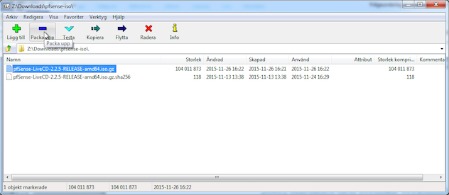

Klicka på "Packa upp" och när den nya frågerutan för "Packa upp" visas på skärmen, klicka på "OK" om alla inställningar och förval är godtagbara.

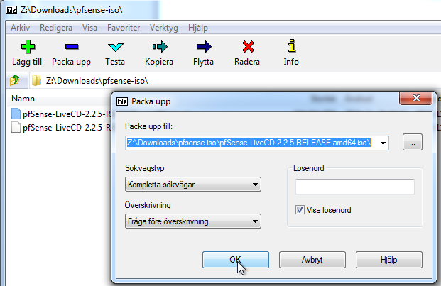

Filen är nu uppackad till en imagefil av typen ISO.

### Skapa installationsmedia
Skapa installationsmediet enligt [instruktionerna](## Skapa installationsmedia).//TODO: Referensen fungerar inte  

### Installera pfSense

  * Starta datorn från det nyskapade mediet

Datorn kommer att starta en välkomstmeny där det finns flera val, det första valet väljs automatiskt om inget annat val görs inom den tid som räknas ner.  

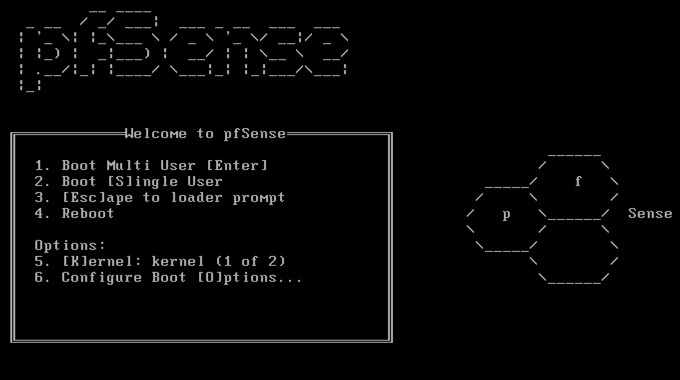

Välj första menyvalet ***1. Boot Multi User [Enter]*** genom att trycka på enter/retur-knappen eller vänta på att tiden löper ut.

Datorn kommer nu att starta en textbaserad installation där det finns flera olika val som visas i bilden nedan.

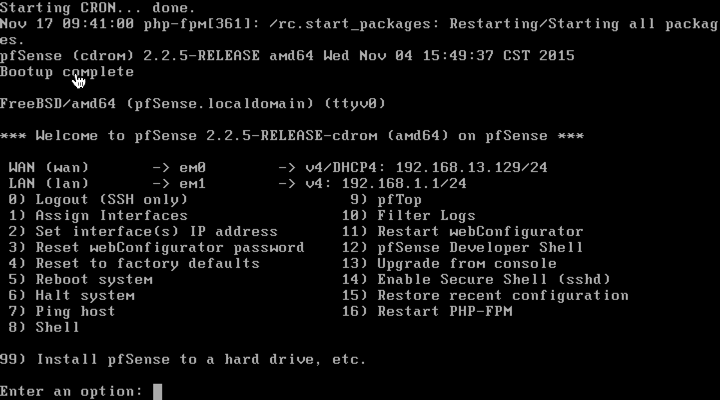

Välj val ***99) Install pfSenese to a hard drive, etc*** genom att skriva *99* och tryck på *enter/retur*

Installationen kommer nu att försöka hitta rätt konfiguration för skärm och tangentbord. Det går att välja ***< Accept these Settings >*** genom att stega ner med piltangenten och tryck på *enter/retur*.

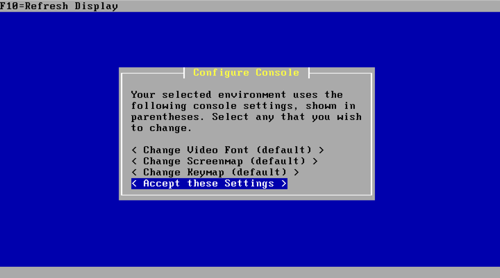

I nästa meny går det att välja vilken typ av installation som ska göras. Välj *< Quick/Easy Install >* genom att trycka *enter/retur*.

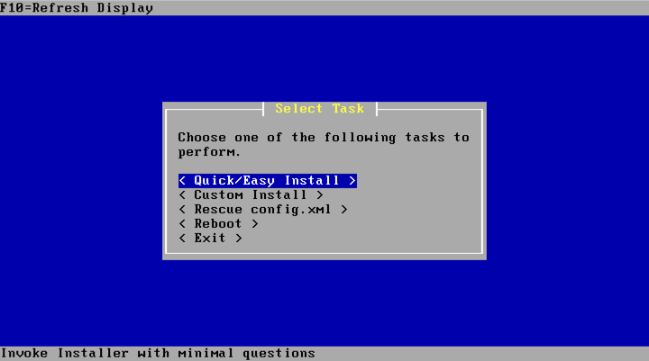

Nu kommer en fråga om du verkligen är säker på ditt val. Här måste du acceptera att installation kommer att vara automatisk och inga frågor kommer att ställas. Det innebär att den första hårdisken kommer att raderas, och detta går inte att ångra. Den säger även att du kan göra installationen manuell om du behöver ha större kontroll.

Tryck *enter/retur* på *< OK >* när OK-knappen är markerad för att fortsätta installationen.

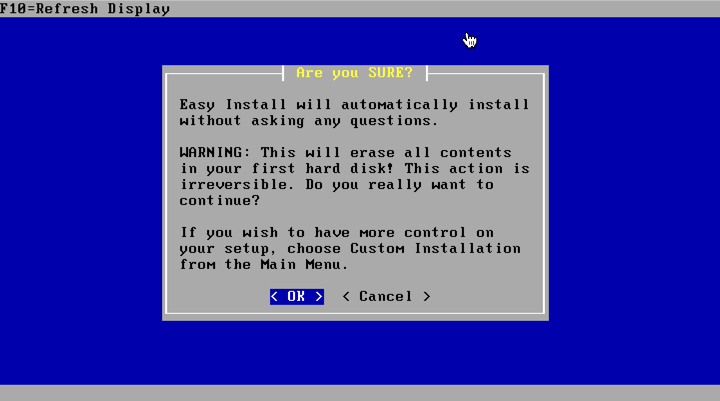

Installationen kommer direkt att fortskrida enligt bilden nedan.

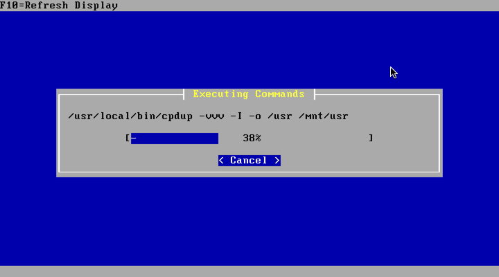

Det kommer att dyka upp en förfrågan efter en stund (fast det står i bekräftelserutan att inga frågor kommer ställas) där val av kärnmodul ska göras. Välj ***< Standard Kernel >*** genom att trycka på *enter/retur* när den är markerad.

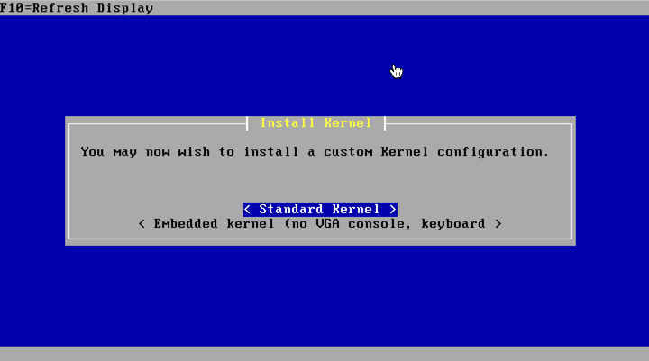

Installationen färdigställs och en sista meny kommer fram som säger att datorn ska startas om, men att installationsmediet måste tas bort under omstarten.

Välj ***< Reboot >*** genom att trycka på *enter/retur* när det valet är markerat.


När datorn nu startas upp kommer brandväggsprogramvaran pfSense vara installerad. Som standard är den förkonfigurerad med följande kontoinformation:

  * Användarnamn: admin
  * Lösenord: pfsense


### Konfigurera pfSense
När pfsense är installerat behövs ytterligare konfiguration för att brandväggen ska vara produktionsduglig  .
Den första startbilden som visas när datorn startar upp är en meny med flera möjliga val samt IP-konfiguration på det nätverkskort som finns på datorn.

Om det finns minst två nätverkskort kommer det ena vara konfigurerat för WAN, det vill säga utsidan på brandväggen. Det andra nätverkskortet kommer att vara insidan och det är den sidan där konfigurationen kan göras ifrån, via ett webbaserat gränssnitt.

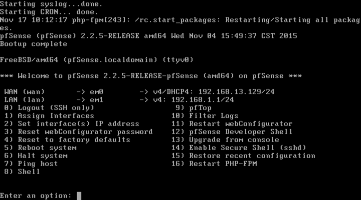  

Titta i konsolen vilket nätverkskort som har LAN och koppla in en dator på det nätverkskortet, datorn kommer då att få en IP-adress dynamiskt i IP-spannet 192.168.1.2-254. För att logga in till gränssnittet ska en webbläsare öppnas och adressen ***http://192.168.1.1*** skrivas in.

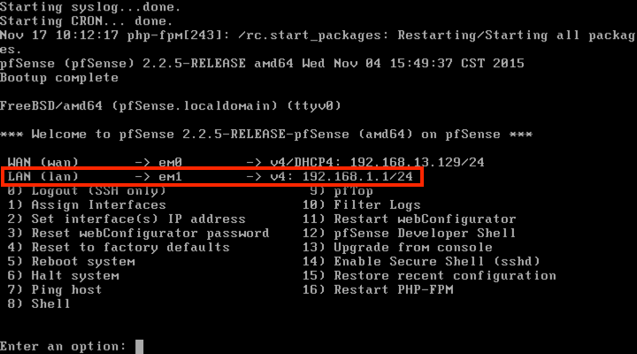

Använd en webbläsare för att komma till webbkonfigurationen. Logga in där med det fördefinierade lösenordet.

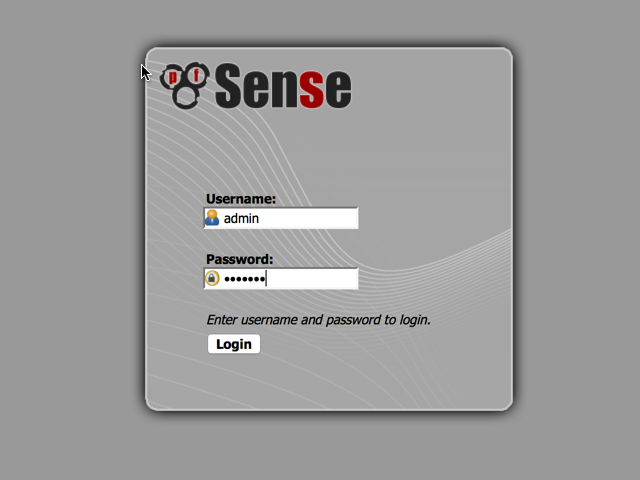

Väl inloggad kommer en konfigurationsguide att starta. Klicka på ***Next*** i rutan.

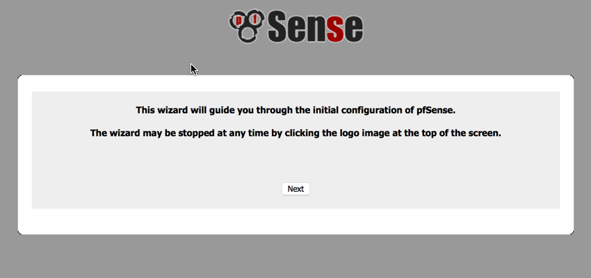

En informationsruta för det supportavtal som kan tecknas visas. Klicka på ***Next***.

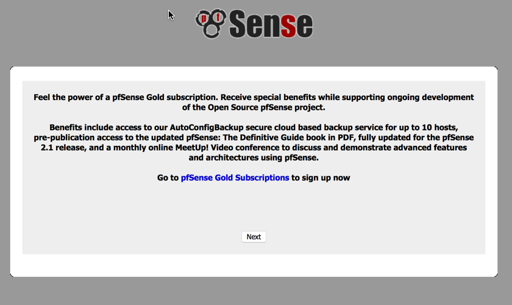

Nu är det dags att fylla i grundläggande information för den aktuella installationen enligt följande:

  * *Hostname:* det datornamn som ska användas.
  * *Domain:* domänamnet som ska användas.
  * *Primary DNS Server:* den primära DNS-servern som kan användas om behov av extern DNS finns.
  * *Secondary DNS Server:* den sekundära DNS-servern som kan användas om behov av extern DNS finns.
  * Checkrutan ska klickas i om DNS-konfiguration ska överskridas av DHCP/PP på WAN-sidan.

Klicka på ***Next*** för att fortsätta.

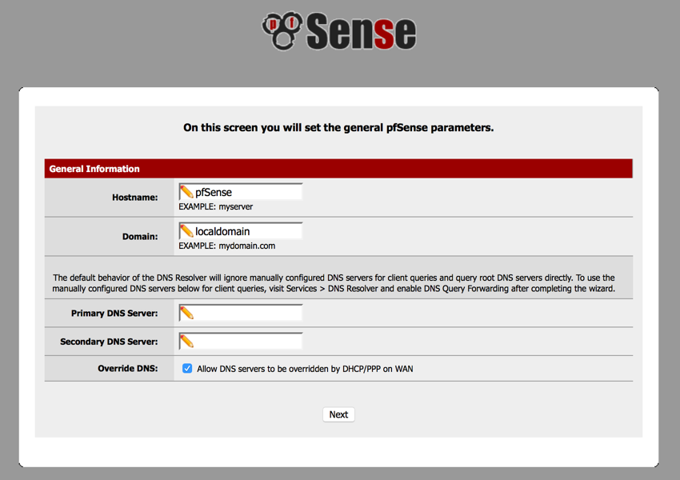

I den här rutan ska tidsinställningar konfigureras:

  * *Time server hostname:* den tidsserver som ska användas för att synkronisera tiden mot.
  * *Timezone:* den tidszon som ska användas.


Klicka på ***Next*** för att fortsätta.

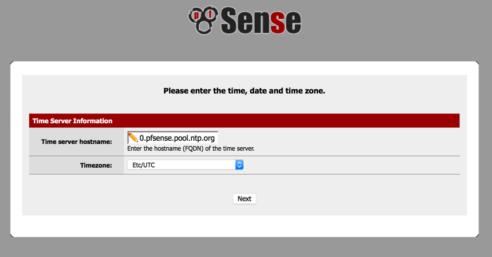

Nu är det dags att konfigurera WAN-sidan av brandväggen.

#### Typ av WAN
  * *SelectedType:* är typen av anslutning, exempelvis statisk IP-adress eller dynamiskt tilldelad.

#### Generell konfiguration
  * *MAC Address:* kan lämnas tom, men det går att välja egen MAC-adress för nätverkskortet.
  * *MTU:* kan lämnas tom, men bör fyllas i om nätverket har speciella krav på MTU.
  * *MSS:* kan lämnas tom, men bör fyllas i om nätverket har speciella krav på MSS.

#### Statisk IP
  * *IP Address:* Den IP-adress som ska användas vid statisk IP-konfiguration.
  * *Upstream Gateway:* Den gatewayadress som ska användas vid statisk IP-konfiguration.

#### Dynamisk IP
  * *DHCP Hostname:* kan lämnas tom om inte nätverket kräver klientidentifikation vid DHCP.

#### PPPoE
  * *PPPoE Username:* Användarnamn när PPPoE används.
  * *PPPoE PasswordDen:* Lösenord när PPPoE används.
  * *PPPoE Service name:* Fylls i om servicenamn används av PPPoE.
  * *PPPoE Dial on demand:* Bockas för om anslutningen bara ska kopplas upp när nätverksanslutningen ska användas.
  * *PPPoE Idle timeout:* Den tidsfördröjning som sker innan anslutningen stängs.

#### PPTP
  * *PPTP Username:* Användarnamn när PPTP används.
  * *PPTP Password:* Lösenord när PPTP används.
  * *PPTP Local IP Address* Lokala IP-adressen för PPTP.
  * *PPTP Remote IP Address:* Fjärr-IP-adressen för PPTP.
  * *PPTP Dial on demand:* Bocka för om anslutningen ska ringas upp vid behov.
  * *PPTP Idle timeout:* Den tidsfördröjning som sker innan anslutningen stängs.

#### Privata IP-adresser
  * *Block RFC1918 Private Networks:* Denna ska bockas för om WAN används mot Internet, används WAN mot interna nätverk kan det finnas behov av att tillåta privata adresser på brandväggens WAN-anslutning.

#### Ej ännu utgivna IP-adresser
  * *Block bogon networks:* användes förr i tiden för att blockera trafik från ej ännu utgivna IP-nätverk. Idag är i princip alla IP-adresser tilldelade och behovet av att stoppa ej utgivna adresser finns inte. Ska specifika adresser blockeras är det bättre att gör det med hjälp av brandväggsreglerna.

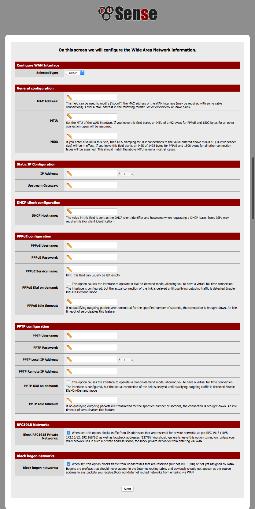

LAN sidan konfigureras genom att ange en IP-adress och den subnätmask som ska användas. Om standardvärdet är ok är det bara att klicka vidare på **Next**.

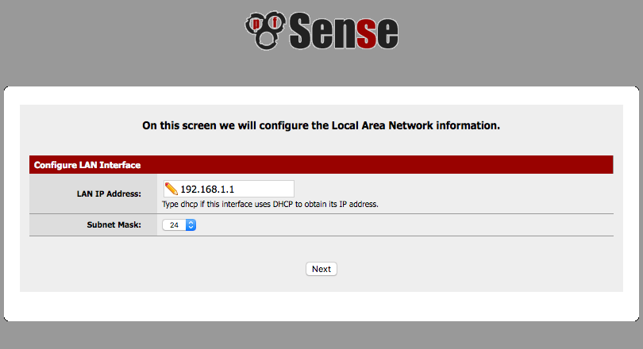

Sätt ett nytt säkert lösenord

  * *Admin Password:* Det nya säkra lösenordet som ska användas.
  * *Admin Password AGAIN:* Det nya säkra lösenordet fylls i igen för att säkerställa att det inte skrevs fel första gången.

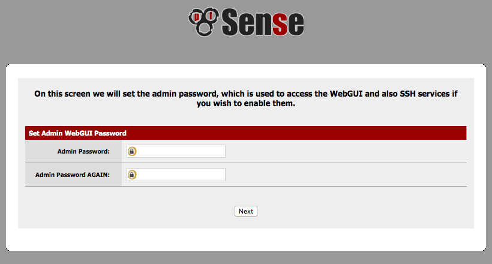

Nu är baskonfigurationen klar. Ladda om sidan genom att klicka på ***Reload***-knappen och vänta tills processen är klar.

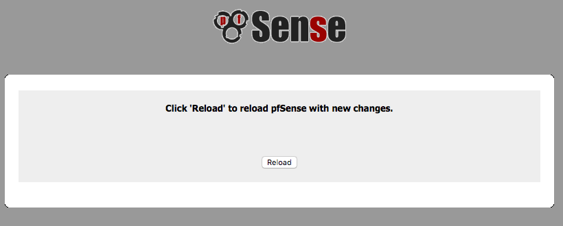

Klicka på *Click **here** to continue on to pfSense webConfigurator* som pilen pekar enligt bilden nedan för att komma till första sidan.

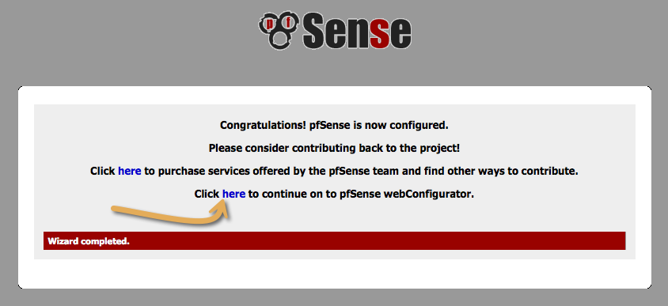


### Använda pfSense

pfSense har en dashboard (statussida) som visas efter inloggning. Längst upp finns det en meny där alla inställningsmöjligheter finns.

  * *pfSense*-logotypen är en länk till själva statussidan.
  * *System*-menyn används för att göra systeminställningar.
  * *Interfaces*-menyn används bland annat för att konfigurera nätverkskort och virtuella LAN.
  * *Firewall*-menyn är till för att konfigurera brandväggsregler.
  * *Services*-menyn är till för att konfigurera nätverkstjänster.
  * *VPN*-menyn är till för att konfigurera VPN-anslutningar.
  * *Status*-menyn är till för att se aktuell status för olika typer av tjänster. Från denna meny går det att komma till loggvyn.
  * *Diagnostics*-menyn är till för att komma åt diagnostikverktyg.
  * *Gold* är en länk till pfSense sida för information om betalversionen.
  * *Help*-menyn är till för att hitta till hjälpdokumentation.


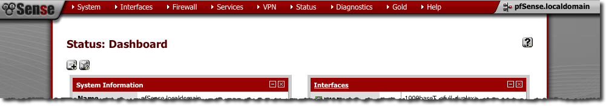

#### Konfigurera ett betrott certifikat
Efter installationen av pfSense går det att konfigurera brandväggen direkt i konsolen och med en webbläsare samt med protokollet SSH. Konsolen och själva brandväggen måste ha fysiskt skydd mot angrepp. För att skydda mot hot via de andra nätverksbaserade åtkomstsätten behövs ytterligare konfiguration.  

SSH är säkert redan efter installation men användare måste verifiera *fingeravtrycket* innan det går att få åtkomst till det över osäkra nätverk.

Det webbaserade gränssnittet är åtkomligt över http på port 80 vilket är ett klartextprotokoll som inte bör användas efter initial konfiguration där konfigurationsdatorn är direktkopplad till brandväggen. Under det förfarandet så kan ett certifikat installeras för att ansluta krypterat med HTTPS.  

Ett certifikat kan skapas på brandväggen och sedan går det att skapa en signeringsförfrågan för att få ett certifikat som är betrott enligt följande.

  * Välj *System - Cert Manager* i menyn.
  * Välj *Certificates* tabben.
  * Välj klicka på *+-knappen*.

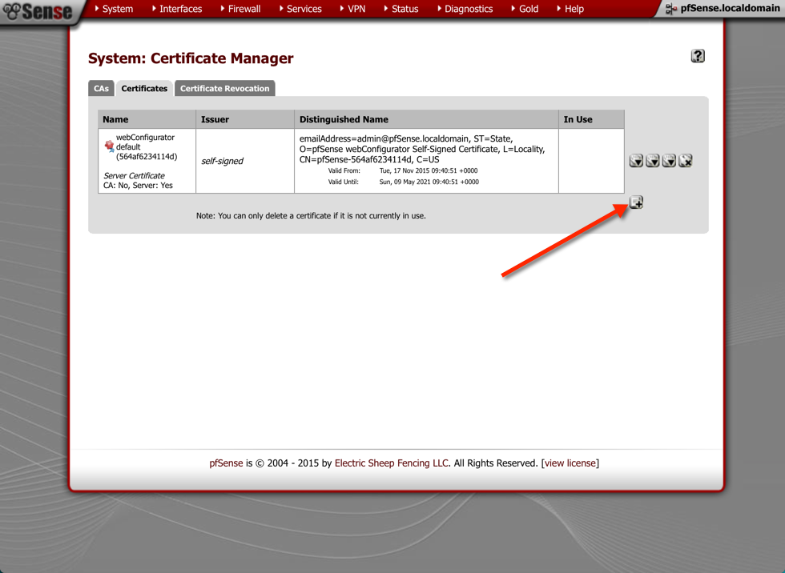

#### Skapa en brandväggsregel  
Som standard tillåter pfSense inte att nätverkstrafik passerar WAN-nätverkskortet. Det måste tillåtas manuellt.

Klicka på menyn *Firewall* och undermenyn *Rules* för att komma till sidan för regelkonfiguration.

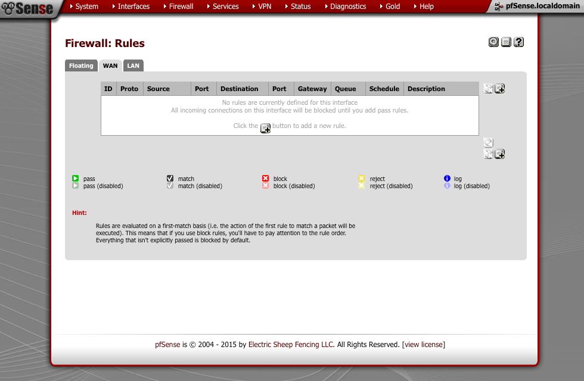

Denna vy visar de regler som finns för WAN-porten. Andra nätverk såsom LAN finns under en egen flik på samma menysida.

För att lägga till en ny brandväggsregel går det att klicka på ***+-ikon-knappen*** som den röda pilen på bilden nedan pekar på.

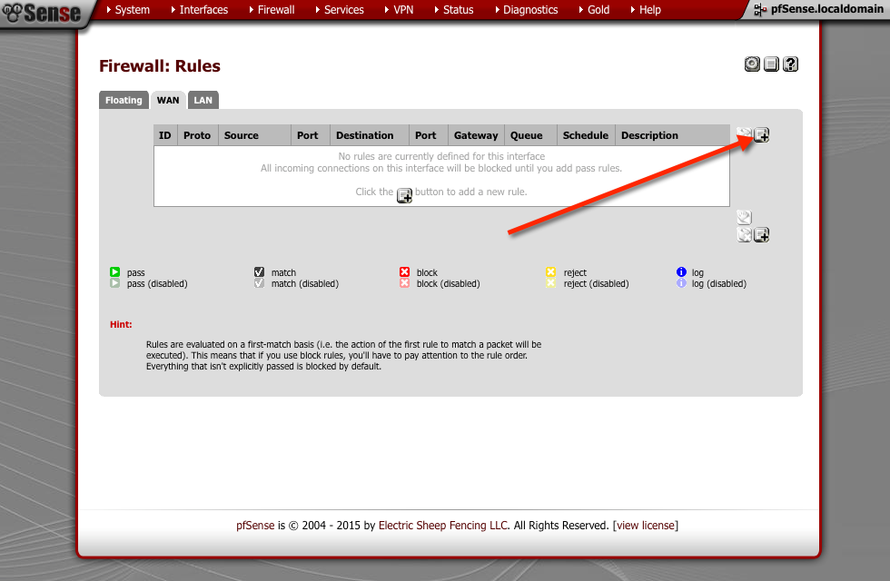

En ny sida visas där en brandväggsregel kan skrivas med följande konfiguration:

  * *Action*, vad som ska ske.
    * *Pass* innebär att trafiken enligt regeln ska få passera.
    * *Block* innebär att trafiken enligt regeln ska blockeras.
    * *Reject* innebär att trafiken enligt regeln ska blockeras men att ett meddelande om att trafiken blockerats skickas till avsändaren.
  * *Disabled* bockas för om regeln inte ska vara aktiverad.
  * *Interface* det nätverkskort/gränssnitt som regeln gäller för.
  * *TCP/IP Version*, vilken eller vilka IP-versioner som regeln gäller för.
    * *IPv4* gäller enbart IPv4 trafik.
    * *IPv6* gäller enbart IPv6 trafik.
    * *IPv4+IPv6* gäller både IPv4 och IPv6.
  * *Protocol*, vilket eller vilka protokoll regeln gäller för, vanligtvis används främst:
    * TCP
    * UDP
    * TCP och UDP
  * *Source*, inställning för att begränsa eller negotiera avsändare.
    * *Type:* är typen av avsändare.
    * *Adress:* är IP-information från avsändare.
  * *Destination*, inställning för att konfigurera destination eller negotiera destination.
    * *Type:* är typen av mottagare.
    * *Adress:* är IP-information från mottagare.
  * *Destination port range* är vilken eller vilka nätverksportar som ska tillåtas enligt regeln.
    * *from:* är första porten i det nummerspann som tillåts.
    * *to:* är den sista porten i det nummerspann som tillåts.
  * *Log*, checkrutan bockas för om trafik som matchar regeln ska loggas.
  * *Description*, en kort text som beskriver regelns syfte. Kan användas för att få spårbarhet till varför den aktuella regeln finns. Exempelvis kan en referens till ett ärendehanteringssystem skrivas in här.

Regeln kan efter dessa inställningar sparas men det går även att göra mer avancerade inställningar om det finns behov för det.

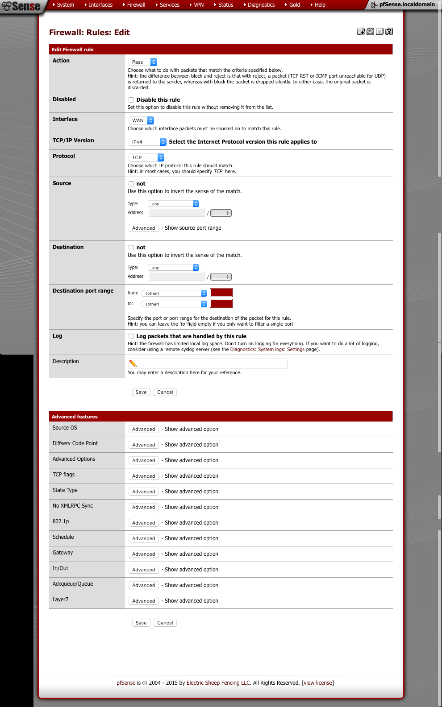

När en regel har sparats måste den även appliceras. Det gör du genom att klicka på knappen *Apply changes* som visas efter att regeln sparats.

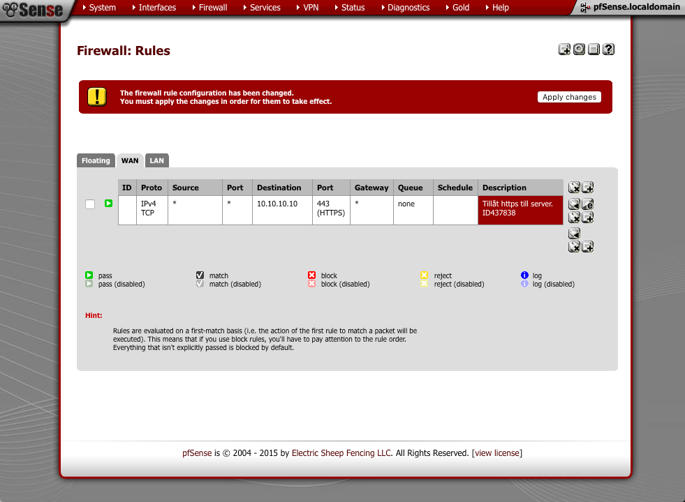

Regler kan sedan byggas vidare för att tillåta den trafik som det finns behov av.

\clearpage
