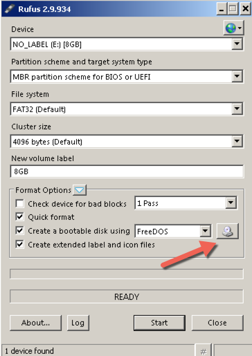

# Skapa installationsmedia

För att skapa installationsmedia måste först en färdigbyggd [iso]-fil laddas ner eller så kan en ny byggas. 

## Ladda ner iso
En iso-fil kan laddas ner enligt de anvisningar som finns för den specifika programvaran som behövs. När den väl är nedladad så måste även den nedladdade filen verifieras så det är korrekt fil som blivit nedladdad samt för att verifiera att den inte är korrupt. För att verifiera enn media kan vägledningen för att verifiera media följas i kapitlet [Verifiera installationsmedia].

## Skapa en iso
För att skapa en iso-fil så måste de rekommendationer för det aktuella bygget följas.

## Olika installationsmedier

När en skivabild har skapats eller laddats ner så kan denna brännas på en DVD-skiva eller överföras till en USB-enhet på ett sådant sätt så att den blir *boot-bar*. Det är även möjligt att använda avbilden för att installera programvaran i en virtuell dator utan att skapa en DVD eller USB-sticka.


### Bränna ISO på DVD-skiva

DVD-skivan måste brännas på ett speciellt sätt för att bli bootbar. Den nedladdade eller skapade iso-filen kan brännas genom de följande beskrivna tillvägagångsätt.

#### Windows
Denna handledning beskriver hur man skapar en boot-bar CD/DVD-skiva på en dator med operativsystemet 
Windows. Exemplet är verifierat med Windows 7 men borde även fungera med andra versioner av operativsystemet.

En ISO-fil, även kallad en *skivavbildning*, är en fil som är en kopia av en hel CD eller DVD med data. När du bränner en CD eller DVD från en ISO-fil har den nya skivan samma mappar, filer och egenskaper som originalskivan. Det vanligaste sättet att få tag i en ISO-fil är att hämta den från en webbplats. Du kan till exempel hämta och sedan använda en ISO-fil när du vill uppdatera datorns programvara.

Du kan bränna en skivavbildningsfil, som ofta har filnamnstillägget .iso eller .img, på en inspelningsbar CD eller DVD med Windows-verktyget för bränning av skivavbildningar. Om den kan brännas på en inspelningsbar CD-, DVD- eller Blu-ray-skiva beror på vilken typ av brännare du använder och vilka typer av skivor den kan bränna, skivavbildningsfilens storlek och på vilken typ av enhet du ska använda skivan.

Följande steg är hämtade från [Microsofts instruktion för CD-bränning]

1. Sätt i en inspelningsbar CD-, DVD- eller Blu-ray-skiva i CD/DVD-brännaren.
2. Öppna Dator genom att klicka på Start-knappen Bild av Start-knappen och sedan klicka på Dator.
3. Leta reda på skivavbildningsfilen i Utforskaren och dubbelklicka sedan på den.
4. Om du har fler än en brännare klickar du på den brännare du vill använda i listan Diskbrännare i Windows-verktyget för bränning av skivavbildningar.
5. (Valfritt) Om du vill kontrollera att skivavbildningen har bränts korrekt på skivan markerar du kryssrutan Kontrollera skivan efter bränning.
6. Om det är viktigt med hög integritet för skivavbildningsfilen (om skivavbildningsfilen till exempel innehåller en uppdatering för inbyggd programvara) bör du markera den här kryssrutan.
7. Klicka på *Bränn* när du vill bränna skivan.  

#### Mac OS X
Denna handledning beskriver hur man skapar en CD- eller DVD-skiva på en dator med operativsystemet Mac OS X. Exemplet är verifierat med OS X El Capitan men borde även fungera med andra versioner.
 
1. Markera iso-filen i *finder*
2. I filemenyn välj *Bränn iso-filen*


#### Linux  

Eftersom det finns väldigt många olika typer av Linuxinstallationer så är det svårt att ge en 
generisk instruktion som fungerar på alla typer av installationer. Nedanstående text beskriver
hur man gör på en Fedora/RedHat/CentOS-Linux som nyttjar sig av den grafiska miljön Gnome. Den
kan stämma även för andra system som nyttjar Gnome-miljön. Texten är hämtad från [Fedora projektets instruktion för CD-bränning].

GNOME är en grafisk installtion som är ganska vanlig och om programvaran "CD/DVD creator" för att bränna DVD:er 
är installerade så görs det enligt följande:

    CD/DVD Creator är skivbränningsprogrammet som är integrerat med GNOME
    Högerklicka på den ISO-fil som ska brännas och välj *bränn till skiva*
	Programet öppnar då en dialogruta
	Klicka på bränn-knappen
	CD/DVD Creator kommer be att en tom skiva ska stoppas in
	Efteråt så kommer ISOn att brännas på skivan 

### Skapa en boot-bar USB-sticka

#### Windows
Denna handledning beskriver hur man skapar en boot-bar USB-sticka med operativsystem på en dator med operativsystemet 
Windows. Exemplet är verifierat med Windows 7 men borde även fungera med andra versioner av operativsystemet också.

Det finns flera sätt att skapa en bootbar USB-sticka. Ett sätt är att ladda ner Rufus från <URL: http://rufus.akeo.ie/>, välja ut FOSS-ison på disk istället för grundvalet "FreeDOS" (se bild) och sen klicka *Start*. Välj "DD-avbild" i rutan som kommer upp. Rufus är gratis, öppen källkod. Den versionen som vi verifierat fungerar är "rufus-2.9.exe" som har SHA56-checksumman: 346e869f0c2b22ada8ccd2516a5c8917b17cbb09bf16d33e74d9559e611753ad.



#### Mac OS X

Denna handledning beskriver hur man skapar en boot-bar USB-sticka med operativsystem på en dator med operativsystemet 
Mac OS X. Exemplet är verifierat med OS X El Capitan men borde även fungera med andra versioner av operativsystemet.

Nedanstående beskrivning är avsett för en vanlig användare av Mac OS X, 
där användaren inte har fullständiga administratörsrättigheter. Detta innebär i praktiken 
att vissa steg måste utföras med hjälp av kommandot "```sudo```" för att temporärt utföra
ett steg med utökade administratörsbehörigheter.

 1. Stoppa in en USB-sticka och öppna ett terminalfönster (programmet "[Terminal]")
 2. Skriv "```diskutil list```" och notera vad USB-stickan heter. T.ex "```/dev/disk3```"

    *OBS - var noggran med att skriva upp rätt namn på stickan, så att ingen annan
     disk blir påverkad av misstag! Är du osäker på vad USB-stickan får för namn, 
     så kan du testa att använda kommandot "```diskutil list```" ett par gånger - både med
      USB-minnet anslutet respektive när minnet inte är instoppat - för att se skillnaden på listan.*

 3. Avmontera stickan med kommandot: "```diskutil unmountDisk /dev/disk3```"
 4. Skriv ISO-filen till USB-stickan: "```sudo dd if=./foss.iso of=/dev/disk3 bs=10m```"
    a. Då filen foss.iso är väldigt stor, så kommer det här kommandot ta en ganska lång stund, typ 5 minuter eller mer. Tiden beror bland annat på typen av USB-sticka, där det finns olika snabba USB-minnen.
    b. Du kommer få en fråga om att ange lösenord för att köra kommandot "sudo". Detta är ditt vanliga lösenord som du anger för inloggning till systemet.

    Om allt har gått enligt plan, så skall du ha sett text liknande nedanstående i terminalfönstret:

```
	bash-3.2$ sudo dd if=./foss.iso of=/dev/disk3 bs=10m
	132+1 records in
	132+1 records out
	1391460352 bytes transferred in 475.954652 secs (2923515 bytes/sec)
	bash-3.2$
```

 5. Avmontera USB-stickan ordentligt, så att operativsystemet anser att USB-minnet är redo att avlägsnas från datorn, med kommandot: "```diskutil eject /dev/disk3```"


#### Linux  
Denna handledning beskriver hur man skapar en boot-bar USB-sticka med operativsystem på en dator med operativsystemet Linux. 

 1. Anslut USB-minnesstickan till en USB-port
 2. Öppna ett terminal-fönster
 3. Skriv kommandot "```mount```", notera om disken monterats automatiskt och vad den heter i så fall
 4. Avmontera USB-stickan med kommandot : "```umount /dev/sdX```" noterad under punkt 3
 5. Skriv ISO-filen till USB-stickan: "```sudo dd if=./filnamn.iso of=/dev/sdX```" 

\clearpage
