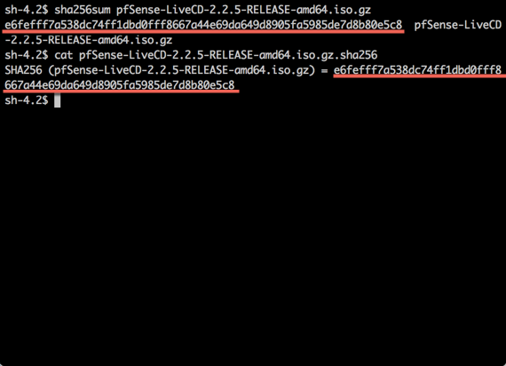
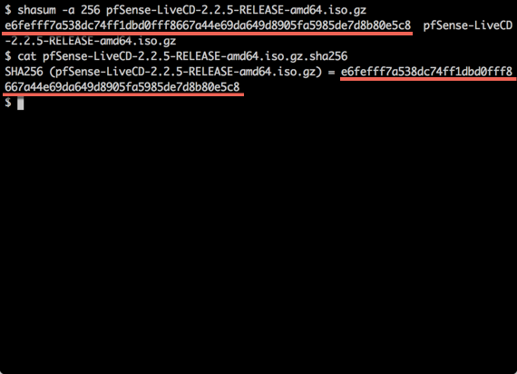
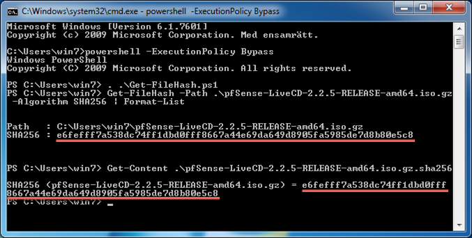

# Verifiera media

All data som laddas ner från en obetrodd källa bör verifieras för att få en garanti på att det är korrekt version som har laddats ner. Ibland går det att ladda ner kod över [TLS] vilket ger en garanti på att det som laddas ner vekligen kommer från rätt källa. I många fall så ladda programvara net över klartext protokoll och då finns det en risk att det nedladdade blir manipulerat. För att undvika det använder många [TLS] på den sida där de presenterar data och där visar de även en eller flera kryptografisk checksummor som sedan kan verifieras när själva filen har laddats ner från exempelvis ett obetrott öppet bibliotek som hanterar lagring och bandbreddstillgången.

#### Verifiera i Linux
Öppna en terminal och skriv kommandona

1. *sha256sum pfSense-LiveCD-2.2.5-RELEASE-amd64.iso.gz*
2. *cat pfSense-LiveCD-2.2.5-RELEASE-amd64.iso.gz.sha256*

verifiera att resultatet i de båda kommandona har samma långa textsträngen

#### Verifiera i Mac OS X
Öppna en terminal och skriv kommandona

1. *shasum -a 256 pfSense-LiveCD-2.2.5-RELEASE-amd64.iso.gz*
2. *cat pfSense-LiveCD-2.2.5-RELEASE-amd64.iso.gz.sha256*

verifiera att resultatet i de båda kommandona har samma långa textsträngen

#### Verifiera i Windows
Windows har tyvärr inte som standard lika enkla sätt för att verifiera kryptografiska checksummor som Mac OS X och Linux. För att verifiera i windows måste först programvara för checksummeuträckning laddas ner.

1. Ladda ner [Get-FileHash.ps1] från Microsoft
2. Starta en kommandotolk
  a. Välj start / kör
  b. Skriv **cmd** och tryck enter/retur en kommando tolk öppnas där följande skrivs
3. **powershell -ExecutionPolicy Bypass**
4. **. .\\Get-FileHash.ps1**
5. **Get-FileHash -Path filsökväg -Algorithm SHA256 | Format-List**
6. Jämför checksumman i resultat med den som nedladdningsidan visar

