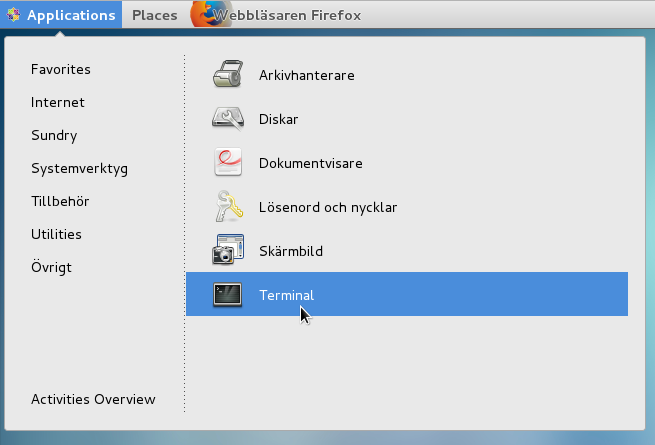
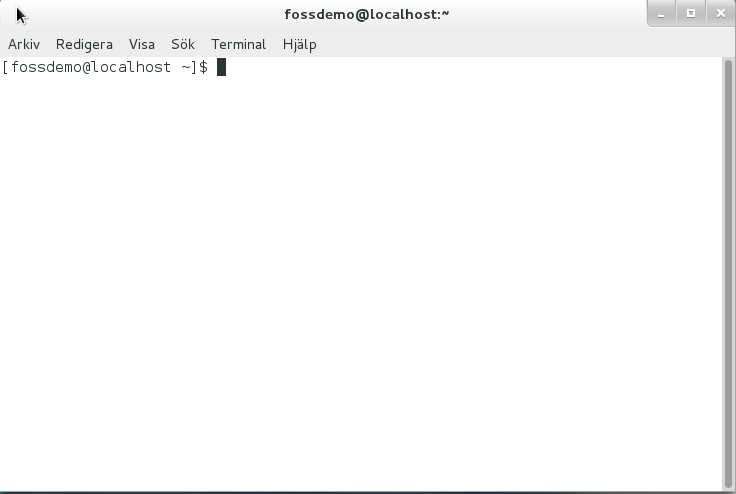
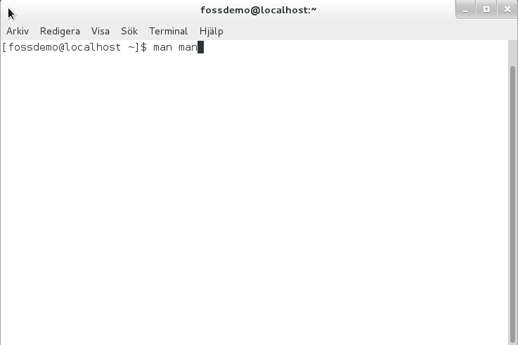
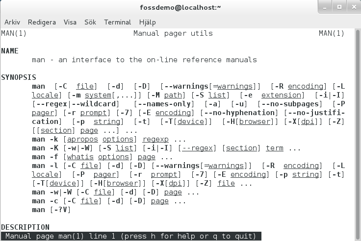
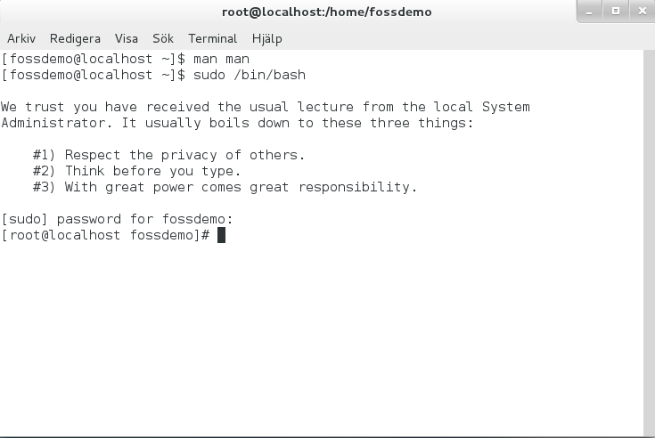

# Terminalåtkomst och kommandoraden

Ett annat sätt att arbeta med systemet, än via det grafiska gränssnittet och de
vyer som vi förberett, är via den traditionella kommandoraden som görs tillgänglig
via ett terminalfönster. Via terminalfönstret och kommandoraden går det att
kontrollera systemet, systemets inställningar samt köra applikationer.

För viss typ av åtkomst, såsom att utföra vissa systemförändringar, är det
bästa sättet att arbeta via just terminalen och kommandoraden.

## Översikt

Terminal, ibland kallat terminalfönster eller terminalemulator, är ett program för att ge kommandoradsåtkomst
till systemet och som finns för dig som användare via menyn ***Applications -> Utilities -> Terminal***. Bilden
nedan visar grafiskt var i menyerna man hittar terminal-alternativet:



Programmet ger kommandoradsåtkomst via en textbaserad vy. Med hjälp av denna vy och via kommandoraden, går det
att nå och använda många av de program som följer med operativsystemet, men som inte är direkt åtkomliga
via det grafiska användargränssnittet. Det går till exempel att skapa eller redigera filer och att automatisera
olika programsteg via att skriva så kallade "skript".

Bilden nedan visar hur ett terminalfönster ser ut och hur en kommandoradsprompt ser ut:



Via terminalfönstret kan man även utföra sådana göromål som att programmera och kompilera egna program.
Terminalen i Linux kan liknas med kommandotolken i Windows, men den har fler funktioner. Windows motsvarighet till
en Linuxterminal är *Powershell* som också finns i moderna Windowsinstallationer.

## Användning

Via terminalen kan man köra ett antal program eller systemkommandon som gör att man
får bättre kontroll på det installerade systemet.

Terminalen kan användas för att få högre rättigheter i operativsystemet för att på så sätt
ändra i program som ägs av andra användare i systemet än den grafiskt inloggade personen som
enbart kan ändra, skapa och exekvera egna program eller filer och inte alla de program och
filer som följer med operativsystemet. Den aktuella installationen använder flera
program/tjänster som ägs av olika typer av systemanvändare i operativsystemet för att
uppnå en bättre säkerhet.

Främsta anledningen till att använda terminalen är för att göra ytterligare konfiguration eller
anpassning i den aktuella installationen. Terminalen kan även användas för bland annat felsökning
eller för att byta IP-adress på datorn.

## Få hjälp i systemet
Utöver att använda denna dokumentation, finns det några andra sätt att få hjälp med hur man kan använda systemet:

1. Använda ```man```-kommandot.
2. Besöka CentOS webbaserade [dokumentation].
3. Använda Google för att söka efter annan dokumentation rörande CentOS, Linux, pfSense, Snort med mera.

För att använda den medföljande systemdokumentationen, använd ```man```-kommandot i ett terminalfönster. Ett enkelt sätt att börja är
att söka dokumentation om ```man```-kommandot, genom att helt enkelt skriva ```man man```. Det ger en lång
lista med information. Skrolla framåt i dokumentationen genom att trycka på mellanslag. Om du vill avbryta listningen,
skriv bokstaven *q*, som i *quit*, och du återgår till kommandotolken.

Nedanstående bild visar hur man ger kommandot ```man man```:



Nedanstående bild visar hur fönstret blir när man skrivit ```man```-kommandot och den visar resultatet av manualsidan:



Dokumentationen som finns tillgänglig på CentOS webbplats är omfattande och finns tillgänglig på flera olika språk, inklusive svenska.

Vart och ett av de programpaket som ingår i denna paketering av säkerhetsprogram har även webbplatser där det finns
dokumentation, bloggar, källkod eller annan bakgrundsinformation.

## Högre rättigheter
Normal användning av systemet och dess medföljande applikationer är att en användare automatiskt loggas in och den grafiska miljön startar upp. Denna användare har en begränsad åtkomst i systemet. Det gör att en mängd saker inte är åtkomliga eller, om de är åtkomliga, inte går att ändra av användaren. Till exempel går det normalt inte att skriva i vissa inställningsfiler som tillhör systemet och som innehåller systeminställningar. För att kunna göra sådana förändringar behöver användaren temporärt få utökade behörigheter i systemet.

För att få högre rättigheter i det installerade systemet kan kommandot ```sudo``` användas. ```sudo``` kan antingen skrivas framför ett kommando som skrivs i terminalen för att utföra en funktion som
kräver högre rättigheter eller för att byta till en annan användare, **root**, som är det konto
som har de högsta rättigheterna i operativsystemet. För att bli root-användare kan man använda kommandot:

```
    sudo su
```

En förfrågan efter den aktuella användarens lösenord kommer att ställas när ```sudo``` används och om rätt
lösenord skrivs in kommer kommandot att ske med högsta behörighet.

Nedanstående bild visar hur fönstret blir när man använder kommandot ```sudo```:




## Textredigeringsprogram

I systemet finns det flera textredigeringsprogram, så kallade texteditorer, installerade och tillgängliga att välja mellan. Med hjälp av dessa editorer kan en fil skapas eller ändras. Exempelvis är programmen *VI* (även VIM som har fler funktioner än den enklare varianten VI), *Emacs* (mg) och *nano* installerade. Det går även att installera ytterligare texteditorer om någon annan editor behövs.
Personer som är vana med att arbeta i Unixmiljöer kan med största sannolikhet använda antingen *vim* eller *emacs*, de som inte är vana med någon av dessa två brukar kunna komma igång snabbare med *nano* eftersom den exempelvis har visuell beskrivning av de vanligaste kommandona. Nano visar visuellt hur programmet kan stängas av eller hur en fil sparas, vilket varken VIM eller Emacs gör eftersom dessa förutsätter att användaren kan de kommandon som ska användas.

### NANO
För att redigera en fil med nano i terminalen så används kommandot ```nano /sök_väg/till/filen```, kommandot avslutas med *enter*. När en fil har blivit vald för att redigeras finns det hjälptext längst ner i terminalfönstret. Alla funktioner såsom spara eller stäng visas med exempelvis ***^X*** där **^** syftar på control(ctrl) knappen och bokstaven till den tangent som ska tryckas ner samtidigt. För att navigera runt i textdokumentet används piltangenterna.

### VIM
VIM finns installerat och kan användas. För dokumentation om hur VIM kan användas finns det i en inbyggd dokumentation som kan visas genom kommandot ```man vim``` i ett terminalfönster.

### Emacs
*Tiny Emacs-like editor* (mg) finns installerat och kan användas för att redigera text och filer. För dokumentation om hur man använder *mg*, går det att använda den medföljande dokumentation på servern som kan visas genom kommandot ```man mg``` i ett terminalfönster.

\clearpage
