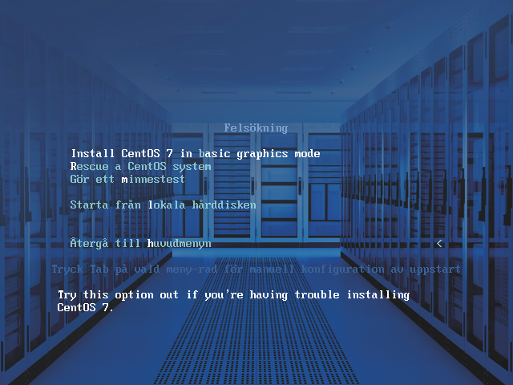

# FAQ: Vanliga frågor och svar
Detta är en sammanställning av vanliga frågor och svar som
rör denna programvaruuppsättning.

1. Bakgrund och översiktsfrågor
     * [Varför har SvK/MSB tagit fram dessa verktyg?]
     * [Vem är målgruppen för att använda dessa verktyg?]
     * [Hur kommer dessa verktyg underhållas?]

2. Detaljfrågor
    * Kända problem
        * [Jag har satt upp allt, men får inga larm i övervakningsservern, vad kan ha hänt?]
        * [Jag har precis installerat en server, men jag kan inte nå webbgränssnittet. Vad är fel?]
    * Paketering
        * [Vad är skillnaden mellan den här paketeringen och Security Onion?]
        * [Finns det skillnader i paketeringen av de olika funktionerna?]
    * Operativsystem
        * [Vilken version och distribution av Linux används?]
        * [Varför har man valt denna Linuxversion?]
        * [Varför använder ni två olika operativsystem?]
    * Installation
        * [Vilka hårdvarukrav ställs på den utrustning som ska användas?]
        * [Hur hanterar programvaran att min dator har flera nätverkskort och Ethernetanslutningar?]
        * [Servern jag installerat hittar ingen nätverksadress. Vad kan vara fel?]
        * [Kan jag köra flera av funktionerna på en och samma server?]
    * Systemadministration och avancerad användning
        * [Hur kommer jag åt webbgränssnittet via nätverket?]
        * [Kan jag uppdatera systemet?]
        * [Har servrarna stöd för IPv6?]
        * [Servern vill inte starta operativsystemet. Finns det något jag kan göra?]
    * Källkod och byggmiljö
        * [Var finns källkoden till alla programmoduler och paket?]
        * [Jag vill skapa en egen installationsfil utifrån källkoden, hur gör jag?]
    * Användning
        * [Hur stänger jag av en server?]
        * [Texten är så liten på skärmen, kan jag ändra teckenstorlek?]
        * [Hur gör jag för att sätta webbläsaren i fullskärmsläge?]
        * [Upplösningen på skärmen är låg. Kan jag ändra till en högre upplösning?]
    * Säkerhet
        * [Hur har lösningen säkrats upp?]
        * [SELinux omnämns hela tiden, hur har ni använt det?]
    * IDS
        * [Vilka regler är aktiverade i IDS-lösningen?]
        * [Finns det andra SCADA-regler som inte är medpaketerade?]
        * [Hur ser regelverket ut, finns det något exempel på hur IDS-reglerna är utformade?]
        * [IDS-lösningen larmar väldigt mycket, varför gör den det?]
        * [IDS-lösningen larmar väldigt mycket, kan jag göra något åt det?]
      	* [Vad är skillnaden mellan den här paketeringen och Security Onion?]
        * [Förutom snort, finns det andra moduler på IDS-systemet jag kan använda mig av?]
        * [Snorby-dashboard summeringen uppdateras inte.]
    * Loggservern
        * [Kan jag söka efter en textsträng i alla loggar?]
        * [När jag listar innehållet i en logg, kan jag söka efter en textsträng då?]
    * Nätverksinspelning
        * [Förutom tcpdump, finns det andra moduler på nätverksinspelningssystemet jag kan använda mig av?]
        * [Hur hanteras diskutrymmet på nätinspelningsservern?]
      	* [Hur kan jag spara undan nätverksinspelningar från nätverksinspelningsservern?]
    * Övervaknings- och larmserver
        * [Kan jag använda övervakningsservern för att övervaka de andra servrarna som ingår i den paketerade lösningen?]
        * [Kan jag använda övervakningsservern för att övervaka ICS/SCADA-utrustning?]
        * [Kan jag använda övervakningsservern för att övervaka annan infrastrukturutrustning, såsom exempelvis kylsystem eller enheter för avbrottsfri ström?]

## Bakgrund och översiktsfrågor

### Varför har SvK/MSB tagit fram dessa verktyg?
Verktygen har tagits fram för att det finns ett behov av standardverktyg, som inte kostar pengar och som kan ingå i ett grundskydd, för svenska elbolag, och i förlängningen för bolag även i andra samhällsviktiga branscher.

### Vem är målgruppen för att använda dessa vertyg?
IT-säkerhetsansvariga, IT-ansvariga, processingenjörer, driftchefer med flera som vill förändra och förbättra IT-miljöer i de industriella automationslösningar som förekommer på svenska bolag i samhällsviktiga branscher.

### Hur kommer dessa verktyg underhållas?
Allt släpps som öppen källkod, och bygger till stora delar på öppen källkod.
Det innebär flera saker och betyder bland annat:

* Att många av de ingående komponenterna redan har befintliga grupper, enskilda personer, organisationer eller företag som står bakom och underhåller dem.
* Att all nyutvecklad källkod finns tillgänglig för allmänheten. Det gör det möjligt för vem som helst att
  granska, förändra, förbättra, underhålla eller på annat sätt arbeta med filer och information
  som tagits fram under projektet.
* Att det är fritt fram för enskilda personer eller företag att ta på sig en roll för
  att underhålla verktygen.

## Detaljfrågor

### Jag har satt upp allt, men får inga larm i övervakningsservern, vad kan ha hänt?

Det kan bero på att tiden inte är korrekt mellan det system som genererar larmet och larm/övervakningsservern.

En lösning är att försöka ställa in klockan till korrekt tid samt att sätta tidszonen till UTC-tidzon.

### Jag har precis installerat en server, men jag kan inte nå webbgränssnittet. Vad är fel?
Webbgränssnittet gå bara att få åtkomst till från konsolen.

### Vad är skillnaden mellan den här paketeringen och Security Onion?

[Security Onion] är en annan paketering av nätverksövervakningsverktyg. Nedan
görs en kort sammanfattning av några skillnader mellan dessa två paket.

Det finns följande fördelar med de paketerade verktygen som ingår i denna dokumenterade lösning jämfört med SecurityOnion:

* Utförlig dokumentation som hjälper till för att en användare ska kunna komma igång.
* All dokumentation är på svenska.
* Modernt operativsystem.
* Särskild fokus på att få ett härdat grundsystem.
* Särskild fokus på att säkra upp användningen av de applikationer som används.
* Speciella säkerhetsfunktioner installerade (SELlinux-policies anpassade för ändamålet).
* Anpassade funktioner för ICS/SCADA-användning.
* Bifogade IDS-regler för ICS/SCADA.

### Finns det skillnader i paketeringen av de olika funktionerna?

Många grundfunktioner och grundläggande program delas och används av alla programpaketen. Det finns dock vissa skillnader i hur de olika servrarna sedan installeras och vilka programpaket som installeras.

Till exempel används den väldigt enkla webbservern lighttpd för nätverksinspelning- och loggservern.
Detta för att minska attackyta och komplexitet. För larmservern (icinga) och
intrångsdetekteringsservern (snort) används i stället webbservern [Apache]. Apache används för att
dessa servrar kräver extramoduler och mer avancerad funktionalitet från webbservern.

### Vilka hårdvarukrav ställs på den utrustning som ska användas?

De krav som finns på den hårdvara som ska användas som plattform för installation av
dessa programpaket finns närmare beskrivna i kapitlet [Några kommentarer om hårdvara och hårdvarukrav].


### Vilken version och distribution av Linux används?

Som bas för de paketeringen har [CentOS] 7 använts.

### Varför har man valt denna Linuxversion?
Valet av Centos är baserat på flera kriterier:

* Det är en mogen plattform.
* Den är en fri plattform, för vilken man inte behöver köpa supportkontrakt eller teckna licenser och få därtill hörande kostnader.
* Det finns en relaterade kommersiell variant, RedHat Enterprise Linux, som de som har stora behov av supportkontrakt kan använda i stället. Det är bara att flytta över alla programpaket och uppsättningar till RHEL-miljön.
* De flesta relevanta programpaket fanns redan porterade till plattformen, därför gick det att använda programpaket i stället för att bygga de från källkodsform.
* Säkerhetsmekanismen SELinux finns i CentOS/RedHat. Det är en funktion vi använt i paketeringen.

### Varför använder ni två olika operativsystem?

Den plattform som vi valt använder sig av CentOS Linux version 7. Alla programmodulerna vi själva
utformat bygger på detta. Brandväggen pfSense som vi också inkluderat, men som är ett färdigt
paket som vi inte själva bygger utan bara dokumenterar, är baserat på operativsystemet [FreeBSD].


### Hur hanterar programvaran att min dator har flera nätverkskort och Ethernetanslutningar?
Såsom vi byggt och paketerat de olika lösningarna, till exempel nätverksinspelningsserver eller
IDS-lösning, ska de fungera automatiskt med flera nätverkskort och nätverksanslutningar.

### Servern jag installerat hittar ingen nätverksadress. Vad kan vara fel?
Detta fel kan uppstå om man glömmer att sätta IP-adresser när systemet installeras.
Likaså kam felet uppstå om man glömmer att klicka i valet "anslut automatiskt till detta nätverk när det är tillgängligt" i samband med installation. Hur denna inställningsruta ser ut kan du se i nedanstående bild:


### Hur stänger jag av en server?

Längst upp i det övre högra hörnet på det grafiska användargränssnittet finns det en knapp för att visa en
meny med diverse kommandon som berör användaren eller systemet. Ta fram den menyn och välj alternativet "Stäng av".


### Texten är så liten på skärmen, kan jag ändra teckenstorlek?

Ja, teckenstorleken i webbläsaren går att ändra. Genom att trycka på ctrl-'+' (kontrolltangenten samt '+' samtidigt) ökas teckenstorleken. För att minska teckenstorleken, tryck ctrl-'-' (kontrolltangenten samt '-' samtidigt).

### Hur gör jag för att sätta webbläsaren i fullskärmsläge?

Om du har startat webbläsaren, kan du trycka F11 (funktionstangent nr 11), vilket
ställer om webbläsaren Firefox mellan att vara i fullskärmsläge eller inte.

### Upplösningen på skärmen är låg. Kan jag ändra till en högre upplösning?

Ja, det går enkelt att ändra upplösningen på den grafiska miljön genom att ändra i systeminställningarna. I applikationsmenyn, välj "Systemverktyg" och sedan "Settings", se nästa bild.


När fönstret för "Settings" visas, välj alternativet "Skärmar", se nästa bild.


Fönstret för "Skärmar" visas. Där går det att ändra flera inställningar, bland annat "Upplösning" i en rullmeny.


Från rullmenyn för "Upplösning", välj en upplösning som bör fungera med det grafikkort som finns i datorn.


Om valet av den nya grafikupplösningen fungerar, kommer ett nytt fönster att bli synligt på skärmen. I det här fönstret finns en kontrollfråga för att se om den valda skärmupplösningen fungerar. Om du ser frågan på skärmen och är nöjd med upplösningen, välj alternativet *"Behåll denna konfiguration"*.


### Kan jag uppdatera systemet?

Ja, genom att köra kommandot ```yum update``` med högsta behörighet på systemet kan du uppdatera de programpaket som finns installerade.
Det innebär att du i ett terminalfönster kör kommandot:

```
	sudo yum update
```

Om du är osäker på hur man gör detta, se detaljbeskrivning i kapitlet [Terminalåtkomst och kommandoraden].

För att detta ska fungera, krävs dock att servern har åtkomst till en fungerande DNS och att den har internetåtkomst.

### Har servrarna stöd för IPv6?

Ja, operativsystemet CentOS har stöd för IPv6. De flesta funktionerna som används i denna paketering har också inbyggt
grundstöd för IPv6. Exempelvis kan loggservern ta emot loggar skickade via IPv6, nätverksinspelningsservern spela
in IPv6-trafik.

För att IPv6 ska fungera korrekt, kan du behöva sätta en IPv6-adress på nätverkskorten som är
aktiverade i servern via [NetworkManager].

### Kan jag köra flera av funktionerna på en och samma server?

Nej, varje funktion (loggserver, larmserver, övervakningsserver, nätverksinspelningsserver, brandvägg)
kräver en anpassad och dedikerad installation.

### Hur kommer jag åt webbgränssnittet via nätverket?

För paketen nätverksinspelningsserver och loggserver går det att ändra inställningarna
så att det går att få fjärråtkomst till systemen. Läs i nedanstående beskrivning hur man gör.

Som standard går webbgränssnittet enbart att nå via den egna datorn, lokalt ansluten
skärm och tangentbord. När servern kommer igång så startar det grafiska gränssnittet lokalt.
Via denna grafiska miljö kan man via en lokalt startad webbläsare komma åt gränssnittet.
Det går alltså inte att nå webbtjänsten direkt via nätverket. Orsaken till detta är att
standardinstallationen ska vara så säkert uppsatt som möjlig.

Om det finns behov av att kunna nå nätverksinspelningsservern från en annan dator måste
konfigurationen för webbservern ändras så att den även är åtkomlig på det externa nätverksgränssnittet.
Då måste kryptering av webbtrafiken samt autentisering av åtkomst till webbsidan aktiveras.
Detta behövs för att hindra att den potentiellt känsliga trafiken kan ses av någon obehörig, eller att servern kan nås av, och loggas in i, av någon obehörig.

Vid första uppstarten av systemet genererades *för installationen unika* så kallade "dummy-cert" för webbservern.
Dessa certifikat finns sparade i filerna **/etc/pki/tls/certs/dummy.cert** och **/etc/pki/tls/private/dummy.key**.
Dessa certifikat kan användas i test-syfte. Om du vill testa att aktivera nätverksåtkomst till
webbtjänsten så kan du undersöka den existerande konfigurationsfilen **/etc/lighttpd/lighttpd.conf**.
Där finns ett utkommenterat exempel på hur det är möjligt att aktivera en server som dels lyssnar på en
extern adress, dels använder kryptering för att skydda trafiken. För att kunna redigera filen,
för att ta bort kommenteringen och kanske sätta en annan IP-adress, starta programmet
*Terminal* via menyn "Applications". I det öppnade terminalfönstret skriv kommandot:

```
              sudo nano /etc/lighttpd/lighttpd.conf
```

Där nano är namnet på ett textredigeringsprogram som medföljer. Använd nano, vi eller mg efter önskemål.
*För hjälp att förstå hur man använder textredigeringsprogram eller hur man använder sig av terminalprogrammet,
se närmare detaljinformation i kapitlet [Terminalåtkomst och kommandoraden].*

Förutom att aktivera nätåtkomst till webbserverdelen samt aktivera TLS-kryptering, måste också
brandväggen öppnas. Liksom för redigeringen av webbserverkonfigurationen ovan, finns det redan utkommenterade
brandväggsinställningar för att underlätta för öppnandet av brandväggsportar och åtkomst till webbservern.
Starta programmet *Terminal* från menyn "Applications". Ta bort kommentarstecknet för raden med
hänvisning till *HTTPS* i filen **/etc/sysconfig/iptables**. Gör det med textredigeringsprogram enligt nedanstående
exempel:

```
              sudo nano /etc/sysconfig/iptables
```

När brandväggsreglerna är ändrade och nedsparade, ladda sedan om brandväggsreglerna med
kommandot:

```
              sudo iptables-restore /etc/sysconfig/iptables
```

### Kan jag söka efter en textsträng i alla loggar?

Genom att skriva in ett sökuttryck på förstasidan (http://127.0.0.1/sok.html) kan du söka efter om
en textsträng förekommer i någon av de sparade loggfilerna.

### När jag listar innehållet i en logg, kan jag söka efter en textsträng då?

Webbläsaren Firefox har en inbyggd sökfunktion som du kan använda för att söka efter en
text på en webbsida genom att trycka ctrl-f (Kontrolltangenten + F). Detta ger en sökruta nere i vänstra hörnet


### Vilka regler är aktiverade i IDS-lösningen?

Som standard i denna paketering av en IDS-sensor och medföljande grafiskt gränssnitt är följande IDS-regler aktiverade:

* Snort:s community-regler.
* Digital Bonds Quickdraw SCADA-regler.
* Extra regler för Siemens S7.
* Enkel regel för icmp echo, för att möjliggöra testning med "ping".

Dessa är installerade för att göra lösningen användbar i en SCADA/ICS-miljö.

Det bör dock noteras att med denna mängd regler och signaturer som är ett smörgåsbord av
beskrivningar av olika nätverksattacker, kommer många signaturer eller attackmönster
inte att vara aktuella för den IT-miljö som de installeras i.

### Finns det andra SCADA-regler, som inte är medpaketerade?

Exempelvis så finns Emerging Threats SCADA-regler. De är inte medpaketerade, då vi inte hunnit
göra extra testning med dessa regler. De kan dock hämtas hem från [EmergingThreats] webbplats
och läggas till i IDS-sensorn.

### Hur ser regelverket ut, finns det något exempel på hur IDS-reglerna är utformade?

Följande exempelregler är framtagna för att användas i SvK:s demonstrator för att visa att det går
att skriva regler för att upptäcka att styrkommandon skickas till PLC-utrustningen från andra
IP-adresser än den kontrollrumsdator som normalt ska skicka styrkommandon.

I exemplet finns två IP-adresser fördefinierade:

* IP-adressen för PLC-utrustningen.
* IP-adressområdet (nätet) för kontrollrummet.

Följande snort-regler larmar för olika typer av ändringar i PLC eller tillgång.

*Notera att raderna är brutna i detta dokument, men att de normalt syns som enstaka långa rader.*

```
ipvar SVKDEMO_KONTROLLRUM 10.10.10.0/24
ipvar SVKDEMO_PLC 10.10.10.10

# Alert on gateopen cmd from unauthorized client
alert tcp !$SVKDEMO_KONTROLLRUM any -> $SVKDEMO_PLC 102 \
(msg: "S7 Communication from Unauthorized Client";sid:1111305;priority:1;rev:1;)

# write var, open gate
alert tcp !$SVKDEMO_KONTROLLRUM any -> $SVKDEMO_PLC 102 \
(content: "|03 00|"; within: 200; pcre: \
"/\x32\x01\x00\x00\x02\x06\x00\x12\x00\x05\x05\x01\x12\x0e\xb2\xff\x00\x00\x00\x52
 \x78\x04\x1f\x0f\x40\x00\x00\x11\xff\x03\x00\x01\x01/";\
msg: "S7 Write Open Gate from Unauthorized Client";sid:1111306;priority:1;rev:1;)

# write var, close gate
alert tcp !$SVKDEMO_KONTROLLRUM any -> $SVKDEMO_PLC 102 \
(content: "|03 00|"; within: 200; pcre: \
"/\x32\x01\x00\x00\x02\x06\x00\x12\x00\x05\x05\x01\x12\x0e\xb2\xff\x00\x00\x00\x52
 \x78\x04\x1f\x0f\x40\x00\x00\x11\xff\x03\x00\x01\x00/";\
msg: "S7 Write Close Gate from Unauthorized Client";sid:1111307;priority:1;rev:1;)

# write var, open generator
alert tcp !$SVKDEMO_KONTROLLRUM any -> $SVKDEMO_PLC 102 \
(content: "|03 00|"; within: 200; pcre: \
"/\x32\x01\x00\x00\x02\x03\x00\x12\x00\x05\x05\x01\x12\x0e\xb2\xff\x00\x00\x00\x52
 \xea\x2d\xb0\xd9\x40\x00\x00\x10\xff\x03\x00\x01\x01/";\
msg: "S7 Write Open Generator from Unauthorized Client";sid:1111308;priority:1;rev:1;)

# write var, close generator
alert tcp !$SVKDEMO_KONTROLLRUM any -> $SVKDEMO_PLC 102 \
(content: "|03 00|"; within: 200; pcre: \
"/\x32\x01\x00\x00\x02\x02\x00\x12\x00\x05\x05\x01\x12\x0e\xb2\xff\x00\x00\x00\x52
 \xea\x2d\xb0\xd9\x40\x00\x00\x10\xff\x03\x00\x01\x00/";\
msg: "S7 Write Close Generator from Unauthorized Client";sid:1111309;priority:1;rev:1;)
```


### IDS-lösningen larmar väldigt mycket, varför gör den det?

De regler som kallas för "snort community rules" är väldigt många och resulterar ofta i larm. Särskilt om du sätter IDS-sensorn på ett nätverk med mycket trafik, det vill säga inte sätter den på ett processnät utan på ett kontorsnät eller ut mot internet.

### IDS-lösningen larmar väldigt mycket, kan jag göra något åt det?

Under katalogen /etc/snort/rules/ finns alla regler som används av Snort. Öppna dem och kommentera ut de regler du tycker larmar för mycket eller inte är rätt för din miljö. Det gör du med den så kallade brädgården #.

### Förutom snort, finns det andra moduler på IDS-systemet jag kan använda mig av?

Förutom Snort kan du installera Suricata från <http://suricata-ids.org/> och konfigurera Barnyard2 så att den
läser från Suricata i stället.

### Förutom tcpdump, finns det andra moduler på nätverksinspelningssystemet jag kan använda mig av?

Wireshark är ett annat verktyg för titta på nätverkstrafik. Det har ett grafiskt gränssnitt, men rekommenderas inte för
att titta på okänd trafik.

### Snorby-dashboard summeringen uppdateras inte

Om det är så att siffrorna aldrig uppdateras kan det bero på ett par olika saker:

* Att klockan inte är rätt inställd.
* Att det finns saker i Snorbys cache som är fel.

Ett sätt att tillfälligt lösa det är att rensa Snorbys cache i MySQL:

    $ sudo -i
    $ mysql -uroot -p$(</root/.mariadb_pass)
    mariadb> use snorby;
    mariadb> truncate table caches;

Gå till Dashboarden, välj meny Administration, "Workers & Job Queue" och radera Cache-jobbet och skapa sedan ett nytt.

En annan lösning är att försöka ställa klockan på rätt tid samt att sätta tidszonen till UTC-tidzon.

### Hur hanteras diskutrymmet på nätinspelningsservern?

På nätverksinspelningsservern finns ett speciellt serverprogram kallat "reaper.py" installerat. Det håller reda på att disken inte fylls av den inspelade trafiken. Programmet kontrollerar
diskutrymmet i samband med att nya filer skapas i filsystemet där den inspelade nätverkstrafiken
sparas. Som standard så ser den till att det ska finnas cirka 20 procent ledigt diskutrymme innan den
börjar radera de äldsta inspelningarna.

### Hur kan jag spara undan nätverksinspelningar från nätverksinspelningsservern?

I webbgränssnittet för servern så finns det möjlighet att välja "ladda ner pcap-fil". Denna pcap-fil innehåller inspelad trafik. För att hålla nere filstorleken delar servern upp inspelad trafik i flera filer. Välj en eller flera filer att ladda ner och analysera med andra verktyg, exempelvis Wireshark 2, på en lokal dator.

### Hur har lösningen säkrats upp?

Operativsystemet och de olika applikationerna som vi använder
har härdats för att ha så liten exponering som möjligt. Det innebär bland annat
att vi började installationen från en minimal operativsystemsinstallation till
vilken vi lagt till programpaket. Detta för att inte ha med onödiga tjänster och
funktioner.

De olika programmen som används i systemet har också fått egna användare, för att
minska möjligheten för ett program att påverka andra delar av systemet.

En annan säkerhetsbarriär som använts är SELinux. De olika tjänster som vi använder i systemet har fått SELinux-policyer som begränsar de körande programmens åtkomst till olika delar i systemet.

### SELinux omnämns hela tiden, hur har ni använt det?

Vi har utvecklat SELinux-profiler för de olika modulerna vi kör. Till exempel webbservrar som visar upp resultat eller runt program som hämtar in information
från nätverket, exempelvis tcpdump.

SELinux är satt i så kallat enforcing-läge, vilket medför att alla överträdelser mot SELinux-policyn
automatiskt innebär att det program som gör överträdelsen stängs ner av operativsystemet.


### Kan jag använda övervakningsservern för att övervaka de andra servrarna som ingår i den paketerade lösningen?

Ja, men det förutsätter några saker:

1. Att servern som ska övervakas sitter på en nätverksport som går att nå (dvs. inte via en span-port eller via en nätverkstapp). Detta gäller framför allt för nätverksinspelningsservern eller IDS-servern.
2. Att servern som ska övervakas har en IP-adress.
3. Att servern är tillgänglig via "ping" (dvs ICMP). Brandväggsreglerna är som standard satta att tillåta att servrarna blir ping:ade.

### Kan jag använda övervakningsservern för att övervaka ICS/SCADA-utrustning?

Ja, men det förutsätter några saker:

1. Att ICS/SCADA-utrustningen som ska övervakas sitter på ett nätverk som går att nå.
2. Att ICS/SCADA-utrustningen som ska övervakas har en IP-adress.
3. Att ICS/SCADA-utrustningen är tillgänglig via "ping" (dvs ICMP). Kontrollera att utrustningen har stöd för ping.

Om mer avancerad övervakning önskas, exempelvis via SNMP, kan övervakningsservern även konfigureras att göra det.

### Kan jag använda övervakningsservern för att övervaka annan infrastrukturutrustning, såsom exempelvis kylsystem eller enheter för avbrottsfri ström?

Ja, men det förutsätter några saker:

1. Att infrastrukturutrustningen som ska övervakas sitter på ett nätverk som går att nå.
2. Att infrastrukturutrustningen som ska övervakas har en IP-adress.
3. Att infrastrukturutrustningen är tillgänglig via "ping" (dvs. ICMP). Kontrollera att utrustningen har stöd för ping.

Om mer avancerad övervakning önskas, exempelvis	via SNMP, kan övervakningsservern även konfigureras att göra det.

### Servern vill inte starta operativsystemet. Finns det något jag kan göra?

Starta upp servern på det installationsmedia som användes, till exempel en USB-sticka eller DVD-skiva. Men i stället för att
utföra en installation, välj alternativet *"Felsökning"* i menyn som visas i samband med att systemet startar. Se bilden nedan:


Från felsökningsmenyn, välj ”Rescue a CentOS system” för att starta upp systemet i ett speciellt felsökningsläge. Se bilden nedan:



Därefter startas ett nytt program upp, varifrån en speciell återställningsmiljö är tillgänglig där man kan försöka
läsa ut existerande filer eller verkställa vissa felsöknings- och felavhjälpningskommandon.


För mer dokumentation och information om hur man gör systemåterställning eller akut administration hänvisar vi till RedHats egen dokumentation: <https://www.centos.org/docs/5/html/Installation_Guide-en-US/ch-rescuemode.html>

### Var finns källkoden till alla programmoduler och paket?

Källkoden till alla paket kommer att vara tillgänglig. Sök via Energisäkerhetsportalen i första hand
eller via Github i andra hand. //Det blir på GitHub. Komplettera med länk.

### Jag vill skapa en egen installationsfil utifrån källkoden, hur gör jag?

Hämta hem den kompletta källkoden med alla filer som ingår i paketeringen. Det finns ett relativt
kort och enkelt skript kallat **create_iso.sh** i paketet. Filen är ett så kallat shellskript
som är en sammansättning av kommandon. Kommandona i skriptet automatiserar ett antal steg för
att färdigställa ett antal moduler, exempelvis dokumentationen, och sedan skapa ett filsystem
med allt nödvändigt innehåll.

För att lyckas bygga installationsfilen, måste ett antal förutsättningar uppfyllas:

* Detta shellskript kräver en Linux-miljö, sannolikt ett CentOS 7-system, för att kunna fungera korrekt.
* Dokumentationen måste kunna skapas. För detta krävs **pandoc** eller om Makefilen i dokumentationskatalogen ändras, ett annat verktyg för att förvandla dokumentation skriven i markdown till pdf, html med mera.
* För att kunna hämta RPM-paketen som behövs till installationen behövs internetåtkomst.

Nedan följer en detaljerad beskrivning av hur detta går till:

1. Starta ett terminalfönster. (Om du är osäker på hur man gör detta, se detaljbeskrivning i kapitlet [Terminalåtkomst och kommandoraden]).
2. Skapa dokumentationen.
3. I den katalog du laddat ner filerna till, byt till underkatalogen med hjälp av kommandot ```cd docs```.
4. I docs-katalogen, skriv ```make all``` för att bygga dokumentationen som krävs innan själva installationsmediet skapas.
5. Ladda ner beroenden.
6. Säkerställ att alla repositories som krävs är aktiverade i byggdatorn:
  1. Installera centos-release-scl-rh.
  2. Lägg till repository image/isolinux/postinstall/config/monitor_server/icinga2.repo.
  3. Lägg till publika signeringsnyckeln image/isolinux/postinstall/config/monitor_server/RPM-GPG-KEY-icinga.
  4. EPEL, går att installera med yum install epel-release.
7. I den katalog du laddat ner filerna till, byt till underkatalogen med hjälp av kommandot cd image.
8. I image-katalogen, kör det medföljande programmet ./download_packages.sh (det här skriptet tog cirka 10 minuter att köra på en testdator).
9. Skapa installationsmedia.
10. I den katalog du laddat ner filerna till, byt till underkatalogen med hjälp av kommandot cd image.
11. I image-katalogen, kör det medföljande programmet ./create_iso.sh (det här skriptet tog cirka 1 minut att köra på en testdator).

Skriptet *download_packages.sh* som körs, laddar ner alla programpaket som behövs i samma katalogen *image/isolinux/Packages*.

Skriptet *create_iso.sh* som körs skapar en fil med namnet **skydd-ics.iso** i samma katalog. Detta är filen med installationsprogrammet som kan brännas till DVD eller installeras på en USB-minnessticka.

Från DVD:n eller USB-enheten går det sedan att boota den aktuella datorn som installationen ska utföras på.


\clearpage
